# PcapUdpExtractor — User Manual

**PcapUdpExtractor** turns UDP traffic — whether stored in a capture file or arriving live on the network — into clean, analysable **CSV**. You tell it how to recognise each kind of message and how to interpret the bytes in its payload, and it writes one neatly-decoded row per packet.

This manual walks through every screen and feature, with screenshots taken from the running application. It is written for end users; for the code-level map see [PROJECT_MINDMAP.md](PROJECT_MINDMAP.md) and [CLAUDE.md](../CLAUDE.md).

> All screenshots in this manual were captured from the live application (Qt 5.10.1 build, dark theme unless noted).

---

## Table of contents

1. [What the app does](#1-what-the-app-does)
2. [Launching the app & the main window](#2-launching-the-app--the-main-window)
3. [Themes (dark / light)](#3-themes-dark--light)
4. [The big picture: how a job is built](#4-the-big-picture-how-a-job-is-built)
5. [File Mode — extract from a .pcap / .pcapng](#5-file-mode--extract-from-a-pcap--pcapng)
6. [Message filters: Port vs Header](#6-message-filters-port-vs-header)
7. [Defining messages (length filters)](#7-defining-messages-length-filters)
8. [Configuring fields](#8-configuring-fields)
9. [Data types reference](#9-data-types-reference)
10. [Bitfield decoders](#10-bitfield-decoders)
11. [Conditional bitfield decoders](#11-conditional-bitfield-decoders)
12. [Compare Options (message verification)](#12-compare-options-message-verification)
13. [Live Mode — capture from the network](#13-live-mode--capture-from-the-network)
14. [NMEA 0183 messages](#14-nmea-0183-messages)
15. [Importing an ICD (Word .docx)](#15-importing-an-icd-word-docx)
16. [Import / export & project files](#16-import--export--project-files)
17. [Output: the CSV files](#17-output-the-csv-files)
18. [Keyboard shortcuts](#18-keyboard-shortcuts)
19. [Troubleshooting](#19-troubleshooting)

---

## 1. What the app does

A UDP packet carries a **payload** — a block of bytes whose meaning is defined by an interface specification (often a Word **ICD** — Interface Control Document). PcapUdpExtractor lets you:

- **Open** a `.pcap` / `.pcapng` file, find the UDP packets you care about, and **export** chosen payload fields to CSV.
- **Listen live** on a UDP socket (including **multicast**) and stream the same field extraction to CSV in real time.
- **Define messages** by UDP port and payload length (or by an NMEA sentence type), and within each message define **fields** with byte offset, type, length, and a scaling/`resolution` formula.
- **Decode bitfields and enumerations** (e.g. status words) into named columns, including *conditional* decoders whose meaning depends on another field's value.
- **Verify** each message during extraction (header, terminator, checksum, refresh-rate, endianness, data-length, message-ID).
- **Bulk-define** everything by importing field tables from CSV/JSON, or by **importing a Word `.docx` ICD** directly.
- **Save your whole setup** as a project file and reload it later.

---

## 2. Launching the app & the main window

Run `PcapUdpExtractor.exe`. The main window opens in **File Mode** with the dark theme:

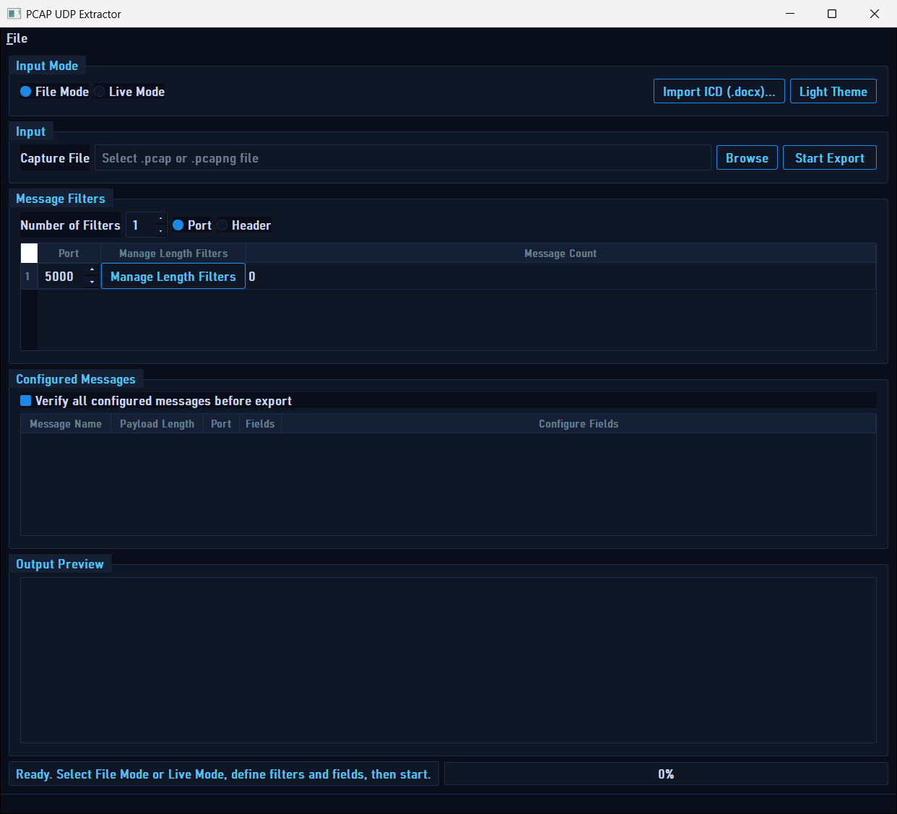

The window is organised top-to-bottom into groups:

| Area | What it is |
|---|---|
| **Menu bar → File** | Open / Save / Save As a project, and Import ICD (see §15–16). |
| **Input Mode** | Switch between **File Mode** and **Live Mode**. Also holds the **Import ICD (.docx)…** button and the **theme toggle**. |
| **Input** | The capture file path + **Browse** + **Start Export** (File Mode). |
| **Message Filters** | How packets are selected: number of filters, **Port** vs **Header** mode, and the per-filter rows. |
| **Configured Messages** | The messages defined for the selected filter, each with a **Configure Fields** button, plus the **“Verify all configured messages before export”** checkbox. |
| **Output Preview** | A live preview table of the rows being exported (capped to a preview limit). |
| **Status bar** | A one-line status message and a progress bar. |

---

## 3. Themes (dark / light)

Click the theme button in the top-right of the **Input Mode** group to toggle between dark and light. The button label shows the theme you will switch *to* (“Light Theme” while dark, “Dark Theme” while light), and the choice is remembered between sessions.

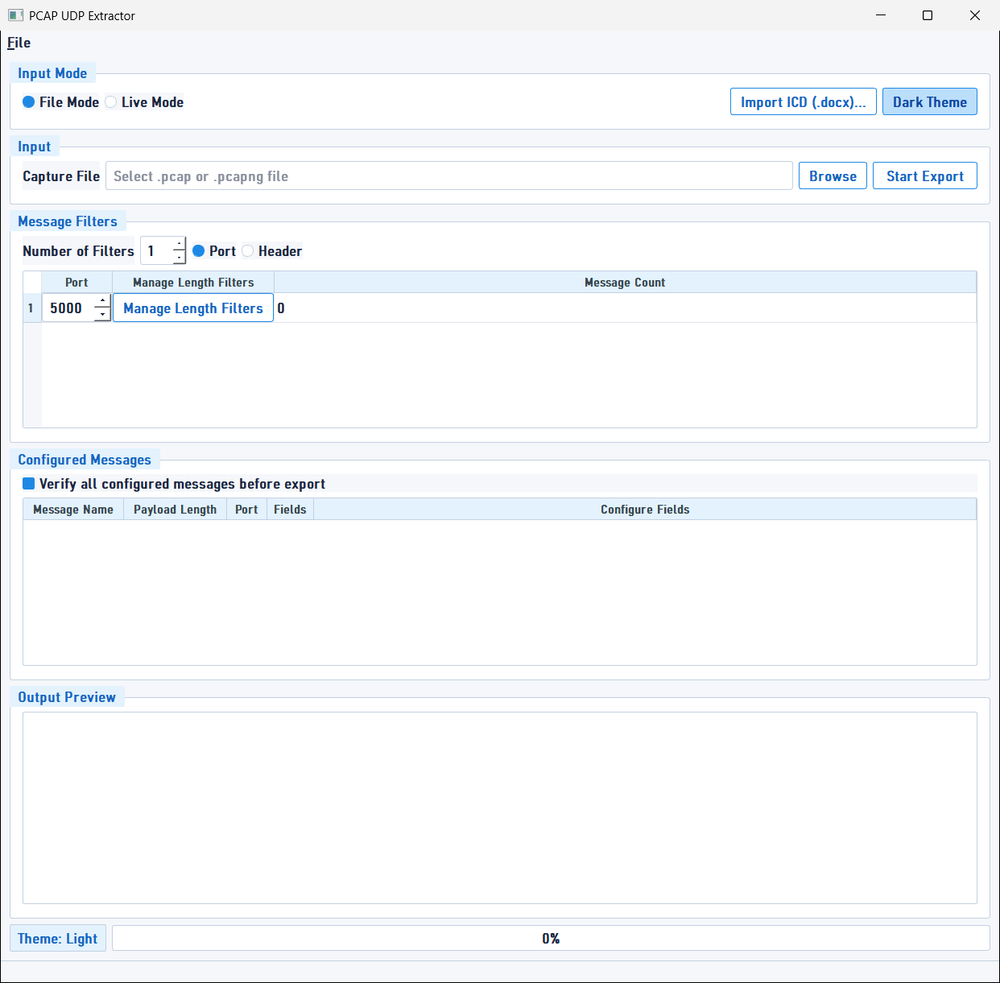

---

## 4. The big picture: how a job is built

Whatever the mode, the workflow is the same three ideas:

```
        ┌── 1. WHERE do packets come from? ──┐
        │   File Mode: a .pcap/.pcapng file  │
        │   Live Mode: a UDP socket (+mcast) │
        └────────────────────────────────────┘
                         │
        ┌── 2. WHICH packets are which message? ──┐
        │   Match by UDP Port + payload length    │
        │   (optionally + a header-byte signature)│
        │   or by NMEA sentence type              │
        └──────────────────────────────────────────┘
                         │
        ┌── 3. HOW are a message's bytes decoded? ──┐
        │   Fields: offset, type, length, scaling   │
        │   + optional bitfield / conditional        │
        │     decoders + optional verification       │
        └─────────────────────────────────────────────┘
                         │
                    ▶ CSV output (one file per message)
```

You can build steps 2 and 3 by hand (dialogs below), or generate them automatically by **importing an ICD** (§15) or a **CSV/JSON** field table (§16).

---

## 5. File Mode — extract from a .pcap / .pcapng

1. Make sure **File Mode** is selected (top-left radio).
2. Click **Browse** and choose a `.pcap` or `.pcapng` file. (If a saved project exists next to that capture, you’ll be offered to restore it — see §16.)
3. Set up your **filters** (§6) and **messages** (§7) and **fields** (§8).
4. *(Optional)* tick **“Verify all configured messages before export”** to first scan the capture and confirm each configured message actually appears, before exporting.
5. Click **Start Export**. You’ll be prompted for an **output folder** (per-message mode) or a base CSV name (legacy single-field-list mode), then the app processes the file and writes the CSV(s). A summary dialog reports totals (packets read, UDP packets, matched packets, exported rows) and the output paths.

The **Output Preview** table fills with sample rows as the export runs, and the status bar shows running counts.

---

## 6. Message filters: Port vs Header

The **Message Filters** group decides which packets are considered. Use **Number of Filters** to create up to several independent filter rows. Choose the matching strategy with the **Port** / **Header** radios.

### Port mode (default)
Each row is a **UDP port**. Packets on that port are then matched to the **messages** you define for the row (by payload length and optional header signature). This is the most common mode.

### Header mode
Switch the radio to **Header**:

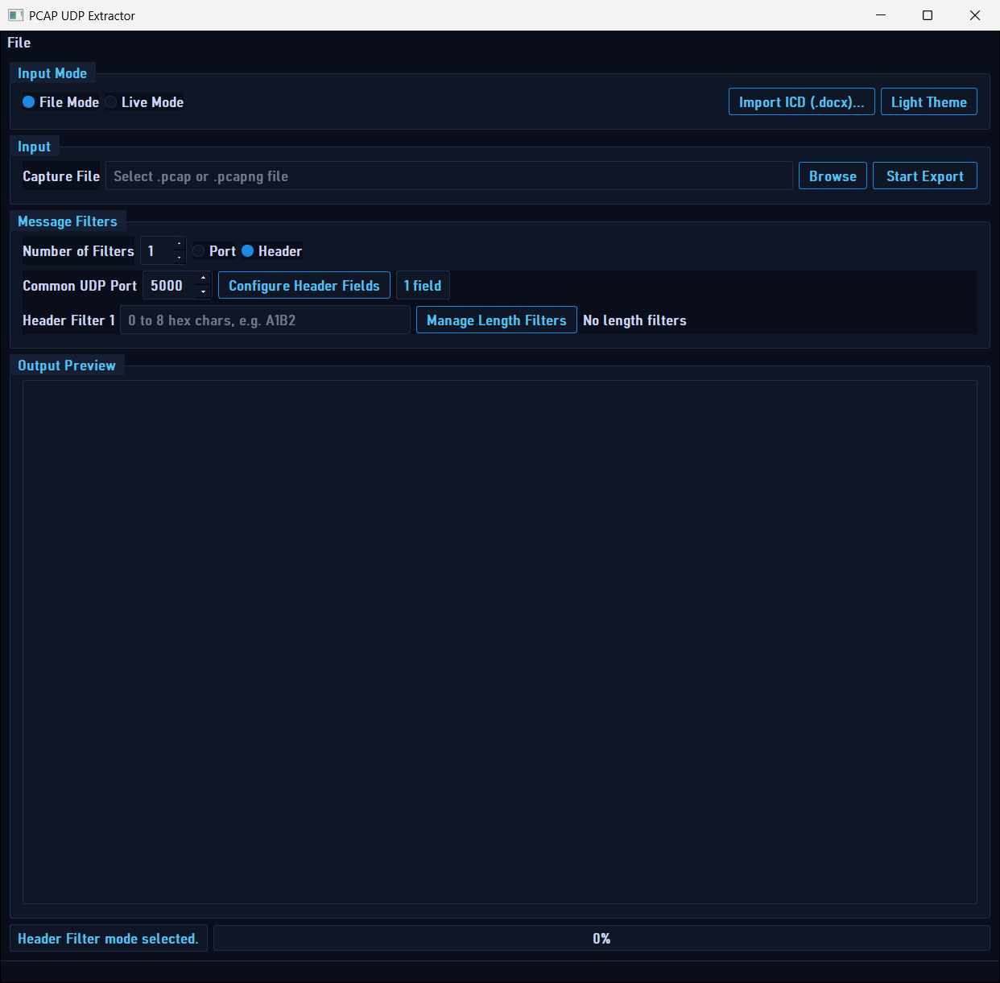

In header mode all rows share one **Common UDP Port**, and each row carries a **header-byte signature** (0–8 hex characters, e.g. `A1B2`). A packet matches a row when its payload begins with that row’s header bytes. You can also attach length-filter messages per header row (**Manage Length Filters**), and **Configure Header Fields** defines the field list applied to header-matched packets.

---

## 7. Defining messages (length filters)

A **message** is a named payload shape on a port. Open the editor with the **Manage Length Filters** button on a filter row:

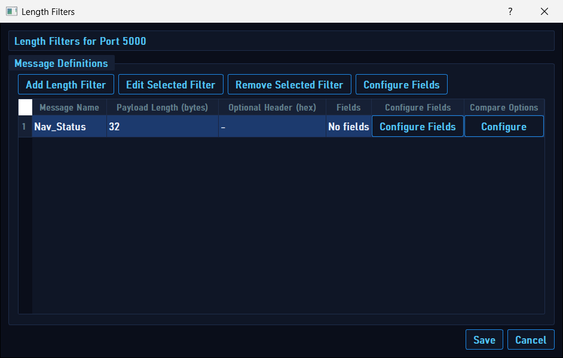

The dialog lists every message defined for that port. Columns: **Message Name**, **Payload Length (bytes)**, **Optional Header (hex)**, **Fields** (count), an inline **Configure Fields** button, and a **Compare Options** “Configure” button.

- **Add Length Filter** opens the message editor (below).
- **Edit Selected Filter** / **Remove Selected Filter** modify the selected row.
- **Configure Fields** (top button or inline per row) opens the field editor (§8).

### The message editor

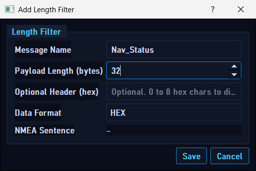

| Field | Meaning |
|---|---|
| **Message Name** | A unique, human-readable name (becomes part of the CSV file name). |
| **Payload Length (bytes)** | The exact UDP payload size that identifies this message. |
| **Optional Header (hex)** | 0–8 hex chars. When set, the payload’s leading bytes must match — this lets **two same-length messages on one port** be told apart by a signature. |
| **Data Format** | **HEX** (decode by byte offsets) or **NMEA** (decode an NMEA 0183 sentence — see §14). |
| **NMEA Sentence** | The chosen NMEA formatter (only relevant when Data Format = NMEA). |

The **Data Format** field is a dropdown:

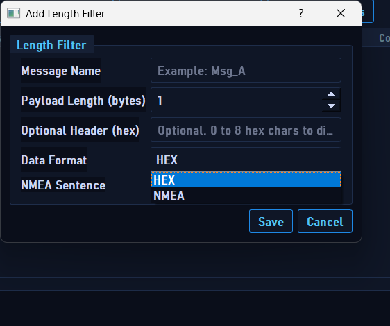

---

## 8. Configuring fields

Fields define how a message’s payload bytes become CSV columns. Open the field editor from **Configure Fields**:

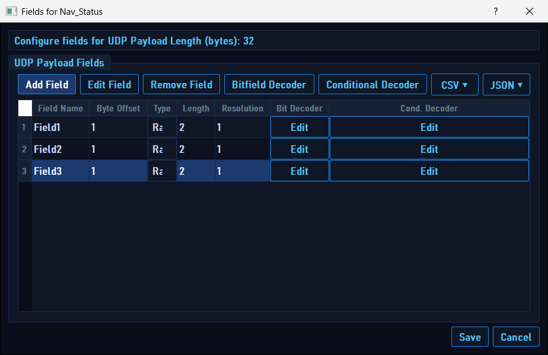

Each row is one field. Columns:

| Column | Meaning |
|---|---|
| **Field Name** | The CSV column header. Unique within the message. |
| **Byte Offset** | **1-based** position of the field’s first byte (the first payload byte is `1`). |
| **Type** | The data type (see §9) — a dropdown in the cell. |
| **Length** | Field length in bytes. Fixed for typed numbers; user-set for `Raw Unsigned BE` and `String`. |
| **Resolution** | A scaling expression (e.g. `1`, `0.01`, `raw*0.1`). The decoded number is multiplied/transformed by this. |
| **Bit Decoder** | Per-row **Edit** button → bitfield decoder (§10). |
| **Cond. Decoder** | Per-row **Edit** button → conditional decoder (§11). |

Buttons across the top:

- **Add Field / Edit Field / Remove Field** — manage rows.
- **Bitfield Decoder / Conditional Decoder** — open the decoder for the selected field.
- **CSV ▾** — Import / Export / Template a field table as CSV.
- **JSON ▾** — Import / Export the field list as JSON (with decoders).

The **Type** cell is a dropdown of the 13 data types; the **CSV ▾** menu offers Import / Export / Template:

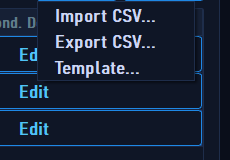

> **Tip:** You can also **drag-and-drop** a `.csv` or `.json` field-definition file onto this dialog to import it.

---

## 9. Data types reference

The **Type** dropdown offers these 13 types (CSV/JSON accept both the friendly label and the enum spelling, case-insensitive):

| Type | Label(s) | Bytes | Notes |
|---|---|---|---|
| Raw Unsigned BE | `Raw Unsigned BE` | user-set (1–8) | Big-endian unsigned integer of any width up to 8 bytes. |
| Uint8 / Int8 | `uchar` / `char` | 1 | Unsigned / signed byte. |
| Uint16 / Int16 | `ushort` / `short` | 2 | |
| Uint32 / Int32 | `uint` / `int` | 4 | |
| Uint64 / Int64 | `ulong` / `long` | 8 | |
| Float32 | `float` | 4 | IEEE-754 single. |
| Float64 | `double` | 8 | IEEE-754 double. |
| Bool | `bool` | 1–8 | `0 → false`, non-zero → `true`. |
| String | `string` / `text` | user-set | UTF-8 text; trailing NULs trimmed. **Length is not capped at 8** (numbers are). |

- **Resolution** applies to numeric types: the raw value is scaled (e.g. `0.01`) or transformed by a formula referencing `raw`.
- Out-of-bounds reads, or a typed field whose length doesn’t match its natural size, produce `N/A`.

---

## 10. Bitfield decoders

A bitfield decoder turns a numeric field (a status word, mode byte, etc.) into one or more **named columns**, each interpreting specific bits. Open it from the per-row **Edit** button in the **Bit Decoder** column:

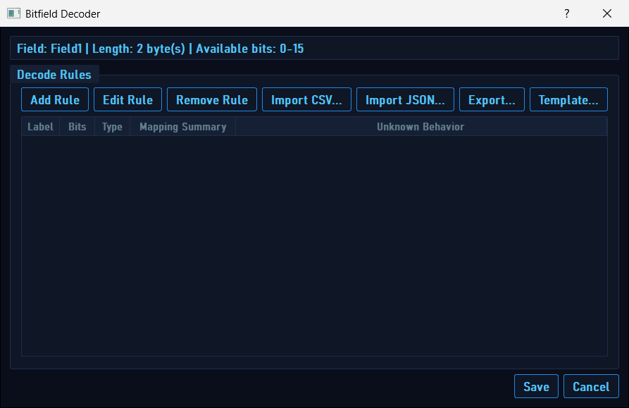

The header shows the field name, its byte length, and the **available bit range** (e.g. `0–15` for a 2-byte field). Each **rule** becomes a CSV column. Manage rules with **Add / Edit / Remove Rule**, and bulk **Import CSV / Import JSON / Export / Template**.

### A single rule

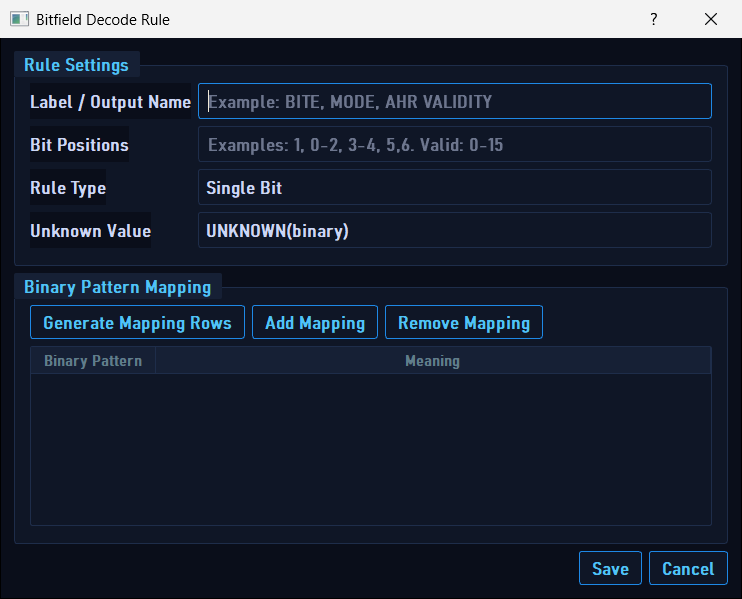

| Setting | Meaning |
|---|---|
| **Label / Output Name** | The CSV column name (e.g. `BITE`, `MODE`, `AHRS VALIDITY`). |
| **Bit Positions** | Which bits this rule reads — single (`5`), list (`1,3,5`), or range (`0-2`). |
| **Rule Type** | *Single Bit* or *Grouped Bits* (derived from the positions). |
| **Unknown Value** | What to emit when a value has no mapping: `UNKNOWN(binary)`, blank, or raw binary. |
| **Binary Pattern Mapping** | The lookup table: each bit pattern → a meaning (e.g. `01 → ENABLED`). **Generate Mapping Rows** pre-fills all combinations for the selected bits. |

---

## 11. Conditional bitfield decoders

A *conditional* decoder selects which bit-decoding **profile** to apply based on the value of another field — the **controller**. Useful when one byte changes the meaning of the rest. Open it from the **Cond. Decoder** column’s **Edit** button (or the **Conditional Decoder** top button):

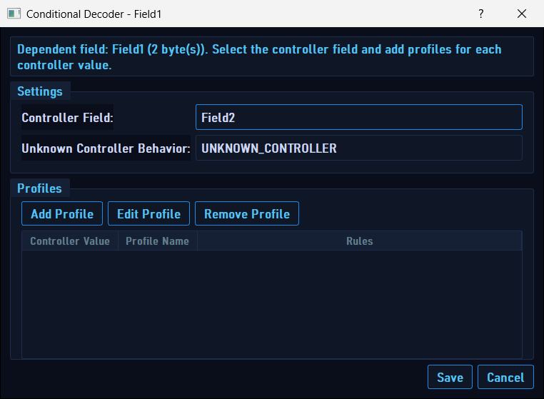

- **Controller Field** — the field whose value chooses the profile.
- **Unknown Controller Behavior** — what to do when the controller value matches no profile.
- **Profiles** — each profile has a controller value, a name, and its own set of bit-decode rules (and optional mutual-exclusion constraints). Add / Edit / Remove profiles here.

---

## 12. Compare Options (message verification)

Compare Options add **verification columns** to a message’s CSV so you can confirm framing and extraction are correct. Open it from the **Configure** button in the **Compare Options** column of the Length Filters dialog:

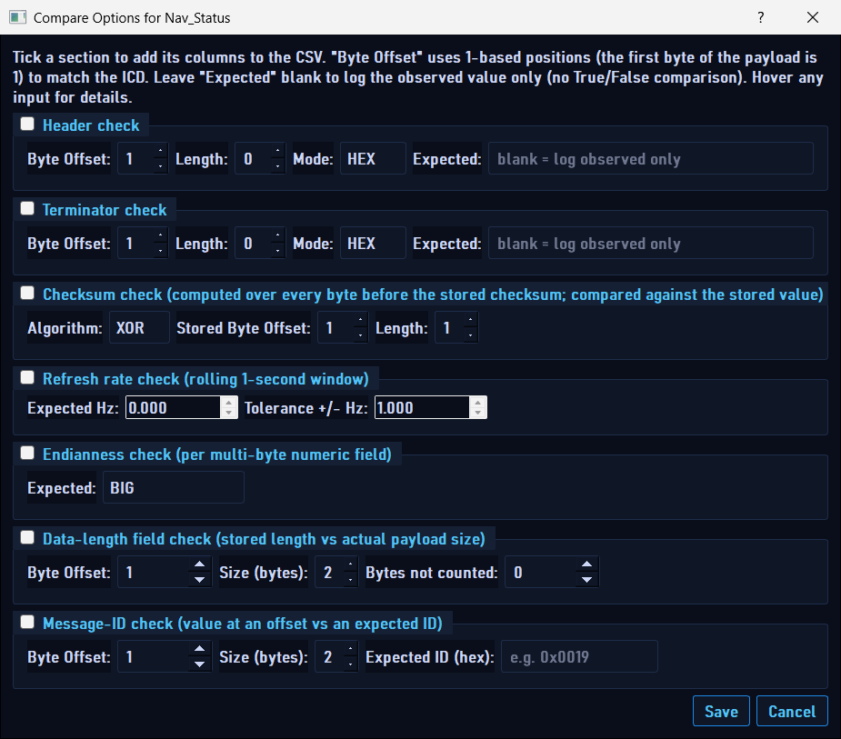

Tick a section to add its columns. Leave an **Expected** value blank to *log the observed value only* (no True/False comparison). All **Byte Offset** values are 1-based.

| Section | Checks | CSV columns added |
|---|---|---|
| **Header check** | Leading bytes against an expected hex value. | `HeaderObserved` (+`HeaderExpected`/`HeaderOK`). |
| **Terminator check** | Trailing bytes against an expected value. | `TerminatorObserved` (+`…Expected`/`…OK`). |
| **Checksum check** | Computes XOR or SUM over the bytes before the stored checksum and compares. | `ChecksumComputed`, `ChecksumStoredInPayload`, `ChecksumOK`. |
| **Refresh rate check** | Observed message rate (rolling 1-second window) vs an expected Hz ± tolerance. | `RefreshRateObservedHz` (+`…Expected`/`…OK`). |
| **Endianness check** | Shows each multi-byte numeric field read as both BE and LE for visual comparison. | `<field>_BE`, `<field>_LE` (+`…_EndianOK`). |
| **Data-length field check** | A length field in the payload vs the actual payload size (with an adjustment for header bytes the field excludes). | `DataLenStored`, `DataLenComputed`, `DataLenOK`. |
| **Message-ID check** | A value at an offset vs an expected ID (entered/shown as hex). | `MsgIdObserved`, `MsgIdExpected`, `MsgIdOK`. |

> The last two (**Data-length** and **Message-ID**) are opt-in and default off; they’re ideal for catching wrong framing on generic ICD messages.

---

## 13. Live Mode — capture from the network

Select **Live Mode** in the Input Mode group:

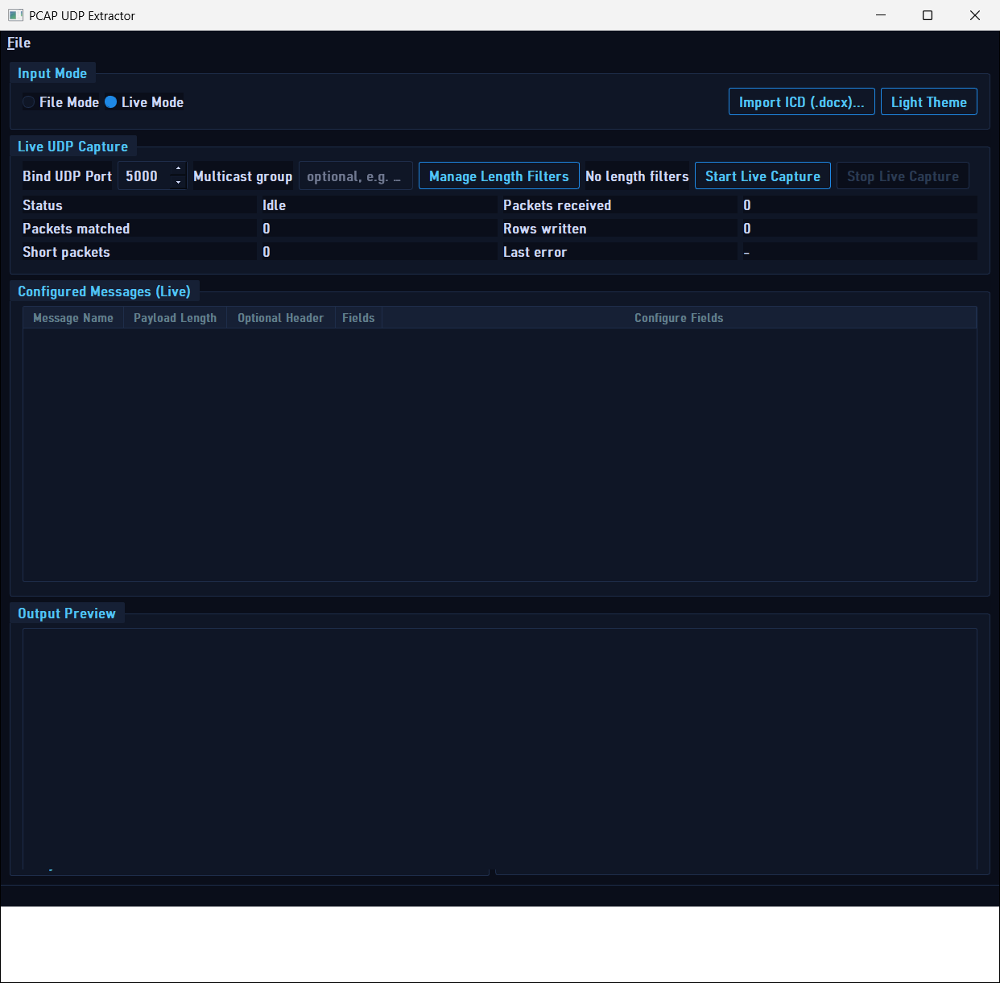

| Control | Meaning |
|---|---|
| **Bind UDP Port** | The local port to listen on. |
| **Multicast group** | *(Optional)* a multicast address (e.g. `239.1.1.1`) to join. Leave blank for ordinary unicast. |
| **Manage Length Filters** | Define the messages to capture (same editor as §7) — at least one is required to start. |
| **Start / Stop Live Capture** | Begin / end listening. On start you choose an output folder; one CSV per message is written and updated in real time. |
| **Status grid** | Live counters: **Status**, **Packets received**, **Packets matched**, **Rows written**, **Short packets**, and **Last error**. |
| **Configured Messages (Live)** | The live message list, each with a **Configure Fields** button. |
| **Output Preview** | A rolling preview of recent matched rows. |

The same field definitions, bitfield/conditional decoders, NMEA decoding, and Compare Options all apply in Live Mode exactly as in File Mode.

---

## 14. NMEA 0183 messages

For ASCII NMEA 0183 traffic (`$GPGGA,...*hh`), set a message’s **Data Format** to **NMEA**. When you do, the **sentence picker** appears:

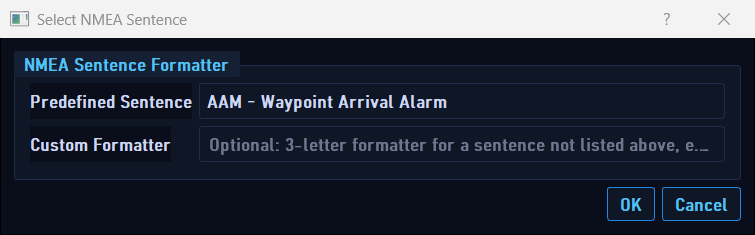

- **Predefined Sentence** — pick from the built-in catalogue of 87 NMEA 0183 formatters (GGA, RMC, GBS, …).
- **Custom Formatter** — or type a 3-letter formatter for a sentence not in the list.

The message editor then shows the chosen sentence:

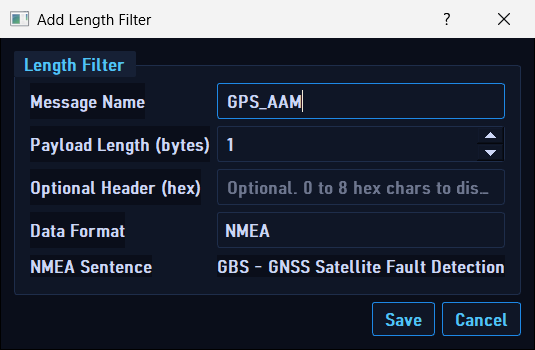

NMEA messages are matched by **sentence formatter** (the port still applies; exact byte length and byte-offset header are ignored). **Configure Fields** opens the NMEA field configurator instead of the byte-offset editor:

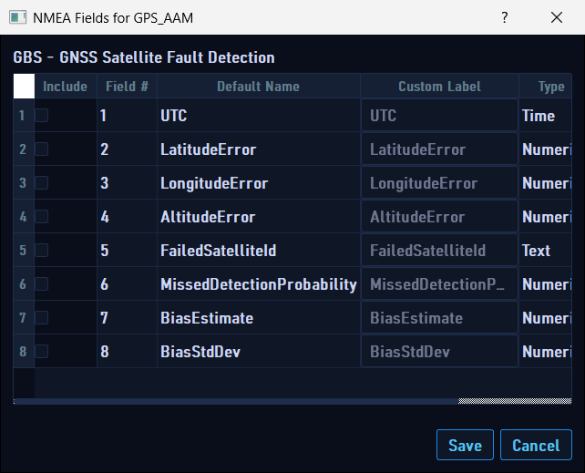

Here fields are addressed by **comma position** in the sentence rather than byte offset. For predefined sentences the configurator is **registry-driven**: tick **Include** to export a field, optionally give it a **Custom Label**; the **Type** (Time / Numeric / Text …) comes from the registry. For a custom formatter you build the field list freely and choose each value’s kind. One CSV row is written per decoded sentence (a datagram with several sentences yields several rows).

---

## 15. Importing an ICD (Word .docx)

Rather than defining every message and field by hand, you can import them from a Word **ICD**. Use **File → Import ICD (.docx)…** (Ctrl+I) or the **Import ICD (.docx)…** button. After choosing a `.docx`, the import dialog opens:

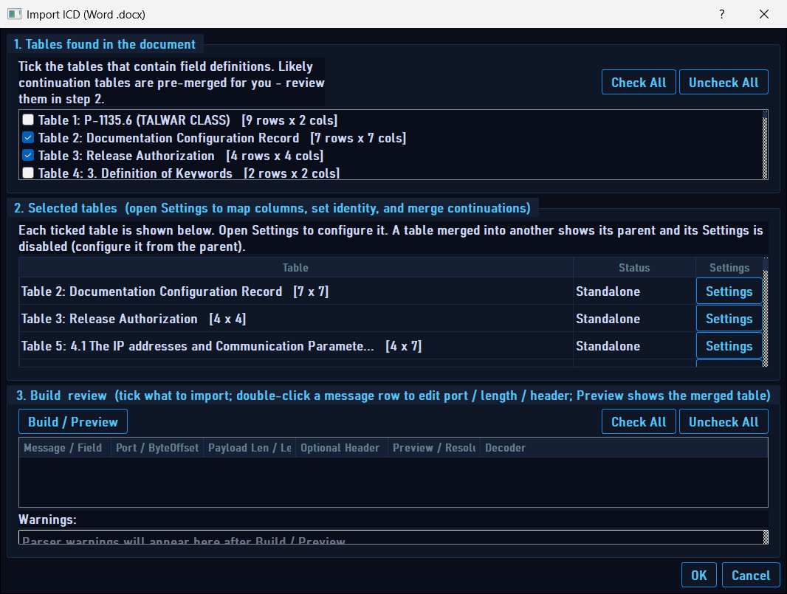

The dialog has **three boxes**:

**1. Tables found in the document** — every table the parser extracted, with its heading and size. Tick the tables that contain field definitions. Likely continuation tables are pre-merged for you. **Check All / Uncheck All** select in bulk.

**2. Selected tables** — each ticked table with its **Status** (*Standalone*, *Parent (N merged)*, or *Merged into Table X*) and a **Settings** button. Settings opens the per-table mapping dialog:

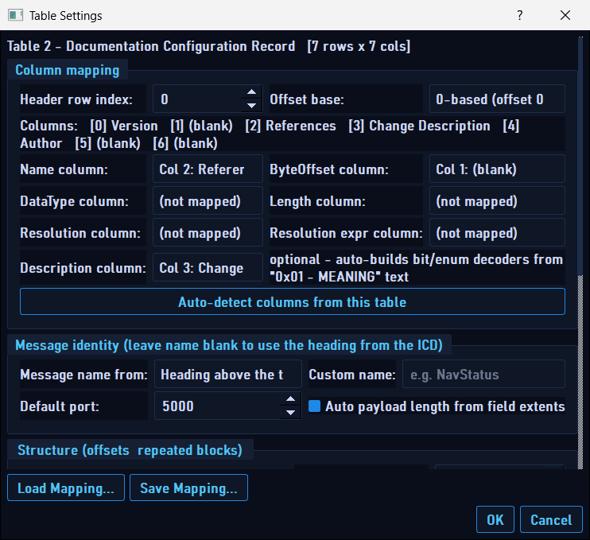

In **Table Settings** you map the table’s columns to fields:
- **Column mapping** — pick the **Header row**, **Offset base** (0- or 1-based), and which columns are **Name / ByteOffset / DataType / Length / Resolution**. The **Description** column can auto-build bit/enum decoders from text like `0x01 - MEANING`. **Auto-detect columns** proposes a mapping for you (content-aware, no AI).
- **Message identity** — the message name (blank = use the ICD heading) and a **Default port**. **Auto payload length from field extents** computes the length from the fields.
- **Structure** — *offsets-from-size* (lay fields back-to-back from a Size column) and *repeated-block replication* (clone a block N times at a stride) for messages with repeating sub-records.
- **Load / Save Mapping** — reuse a named mapping profile across documents.

**3. Build review** — click **Build / Preview** to assemble the messages and fields into a review tree:

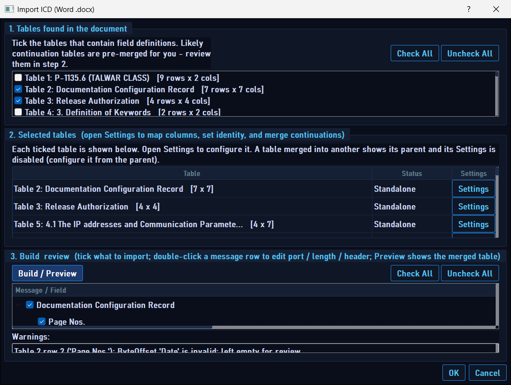

Each message and field appears with a checkbox; **untick** anything you don’t want. Missing/invalid cells are **left blank for review** (never silently dropped) and explained in the **Warnings** panel at the bottom. Field rows are editable, and **DataType** is a per-row dropdown so you can fix unmapped types. Double-click a message row to edit its port / length / header; the **Preview** button shows the merged raw table rows.

Click **OK** to commit. Every kept message is validated, and the messages are injected into the active mode (Live, header, or the selected port row). Incomplete fields are skipped with a note rather than blocking the import. Because they become ordinary messages, they save and reload with your project like any other.

---

## 16. Import / export & project files

The **File** menu holds project operations:

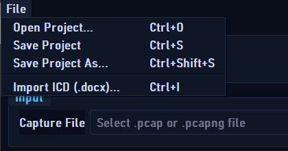

### Project files (`.pcproj.json`)
- **Open Project… (Ctrl+O)**, **Save Project (Ctrl+S)**, **Save Project As… (Ctrl+Shift+S)**.
- A project captures your **entire session**: input mode, filters, all messages and fields (with decoders and Compare Options), live settings, etc.
- The project is a JSON **sidecar** stored next to the capture file (`<capture>.pcproj.json`). When you Browse to a capture that has a sidecar, the app offers to restore it. The project is also **auto-saved** when you close the app.
- You can **drag-and-drop** a `.pcproj.json` file onto the main window to open it.

### Field tables (per message, in the field editor)
- **CSV ▾** → Import / Export / Template. Columns: `Name, ByteOffset, DataType, Length, Resolution, ResolutionExpression`. Header row is order-flexible and case-insensitive; `#` and blank lines are ignored. *(Bitfield/conditional decoders are not included in CSV.)*
- **JSON ▾** → Import / Export the full field list **including decoders** (human-editable nested objects).
- Imports offer **Replace / Append / Cancel**, collect all errors into one dialog, and leave your current table untouched if anything fails.

### Bit-rule tables (in the bitfield decoder dialog)
- **Import CSV / Import JSON / Export / Template** for bulk bit-rule editing. CSV rows are grouped by `Label`; JSON matches the internal rule format. Every import is validated.

---

## 17. Output: the CSV files

- **Per-message export** (the usual path) writes **one CSV per message** into the folder you choose, named from the message and a timestamp.
- Each CSV begins with the field columns (and any bitfield / conditional / NMEA columns), followed by any **Compare Options** verification columns.
- **Legacy single-list export** (header/standalone fields with no per-message definitions) writes one CSV per filter, with packet metadata columns (packet number, timestamp, source/destination IP & port, payload size) plus the field columns.
- CSV is RFC-4180 quoted; cells that look like formulas are protected so spreadsheets don’t misinterpret them.
- During export the **Output Preview** shows sample rows (capped), and a summary dialog reports totals and file paths when finished.

---

## 18. Keyboard shortcuts

| Shortcut | Action |
|---|---|
| **Ctrl+O** | Open Project |
| **Ctrl+S** | Save Project |
| **Ctrl+Shift+S** | Save Project As |
| **Ctrl+I** | Import ICD (.docx) |

Standard dialog keys apply: **Enter** = OK/Save, **Esc** = Cancel.

---

## 19. Troubleshooting

| Symptom | Likely cause / fix |
|---|---|
| **No rows exported / 0 matched packets** | The message’s **payload length** (or NMEA formatter) doesn’t match any packet, or the **port** is wrong. Tick *Verify all configured messages before export* to confirm matches before exporting. |
| **A field shows `N/A`** | Byte offset + length runs past the payload, or a typed number’s length doesn’t match its natural size (e.g. a `uint` with length 2). Check **Byte Offset** (it is **1-based**) and **Length**. |
| **Two messages on one port collide** | Give them distinct **Optional Header (hex)** signatures so they can be told apart. |
| **Live capture receives nothing on a 239.x.x.x address** | Enter the address in **Multicast group** so the socket joins the group (a plain bind won’t receive multicast). |
| **ICD import dropped a field** | It didn’t — incomplete fields are kept blank for review and listed in the **Warnings** panel. Map the missing column in **Table Settings**, fix the **DataType** dropdown in the review tree, or edit the cell, then re-build. |
| **A rebuilt change “doesn’t show up”** | The app may be launched from a different build folder than the one you rebuilt. Confirm the running executable’s path. |

---

*Screenshots and walkthrough generated against the live Qt 5.10.1 build. For the architecture and function-level map, see [PROJECT_MINDMAP.md](PROJECT_MINDMAP.md) and [CLAUDE.md](../CLAUDE.md).*
