# Universal Wireshark Log Reader — Easy User Manual

Welcome! This program takes **network recordings** (or live network traffic) and turns the
raw numbers inside them into a **neat Excel spreadsheet** that you can read and analyse.

This manual is written for **complete beginners**. You do **not** need to be a programmer or a
networking expert. Every technical word is explained the first time it appears, and there is a
plain-English **[Glossary](#23-glossary-every-word-explained)** at the end. Take it one section
at a time — there is a **5-minute Quick Start** below that gets you a real result fast.

> **About the pictures:** every screenshot in this manual was taken from the real program after
> building it on Windows. What you see here is exactly what you will see on your screen.

---

## Table of contents

**The basics**
1. [What this program does (in plain English)](#1-what-this-program-does-in-plain-english)
2. [Starting the program & a tour of the main window](#2-starting-the-program--a-tour-of-the-main-window)
3. [Light and dark themes](#3-light-and-dark-themes)
4. [The big idea: 3 simple steps](#4-the-big-idea-3-simple-steps)

**Quick start**
5. [5-minute Quick Start (from recording to Excel)](#5-5-minute-quick-start-from-recording-to-excel)

**Doing it yourself, step by step**
6. [Step 1 — Choose where the packets come from](#6-step-1--choose-where-the-packets-come-from)
7. [Step 2 — Choose which packets you want (Port or Header)](#7-step-2--choose-which-packets-you-want-port-or-header)
8. [Step 3 — Describe a message](#8-step-3--describe-a-message)
9. [Step 4 — Describe the fields inside a message](#9-step-4--describe-the-fields-inside-a-message)
10. [Data types — the list of "kinds of number"](#10-data-types--the-list-of-kinds-of-number)
11. [Resolution — turning raw numbers into real units](#11-resolution--turning-raw-numbers-into-real-units)
12. [Step 5 — Export and read your Excel file](#12-step-5--export-and-read-your-excel-file)

**Advanced decoding**
13. [Bitfield decoders (splitting one number into flags)](#13-bitfield-decoders-splitting-one-number-into-flags)
14. [Conditional bitfield decoders](#14-conditional-bitfield-decoders)
15. [Compare Options (checking the data is correct)](#15-compare-options-checking-the-data-is-correct)
16. [NMEA messages (GPS-style text sentences)](#16-nmea-messages-gps-style-text-sentences)

**Big time-savers**
17. [Import a Word ICD (.docx) — define everything automatically](#17-import-a-word-icd-docx--define-everything-automatically)
18. [Import / export field tables (CSV & JSON)](#18-import--export-field-tables-csv--json)
19. [Save and reload your work (projects)](#19-save-and-reload-your-work-projects)

**Live network capture**
20. [Live Mode — read packets straight off the network](#20-live-mode--read-packets-straight-off-the-network)

**Reference**
21. [Keyboard shortcuts](#21-keyboard-shortcuts)
22. [Troubleshooting (when something looks wrong)](#22-troubleshooting-when-something-looks-wrong)
23. [Glossary — every word explained](#23-glossary-every-word-explained)

---

## 1. What this program does (in plain English)

Imagine the network is like a postal system. Computers and devices send each other tiny
**parcels of data** called **packets**. This program is good at one specific job:

> **It opens a recording of those parcels, finds the ones you care about, opens them up, reads the
> numbers inside, labels each number, and writes everything into an Excel spreadsheet.**

A few words you'll meet again and again (don't worry, there's a full glossary at the end):

| Word | What it means, simply |
|---|---|
| **Packet** | One small parcel of data sent over the network. |
| **UDP** | One common way of sending packets. This program reads UDP packets. |
| **Port** | A numbered "mailbox" on a computer. Packets are addressed to a port number (e.g. 5000). |
| **Payload** | The actual contents inside a packet — the bytes you want to read. |
| **Byte** | The smallest chunk of data, a number from 0 to 255. A payload is just a row of bytes. |
| **Offset** | The *position* of a byte inside the payload. **The first byte is position 1.** |
| **Field** | One meaningful value inside the payload (e.g. "Latitude"), made of one or more bytes. |
| **Message** | A named kind of packet (e.g. "Track Report") with a known size and a known set of fields. |
| **ICD** | "Interface Control Document" — a Word document that describes the messages and fields. |

You can use this program in two ways:

- **File Mode** — open a recording file (a `.pcap` or `.pcapng` file, the kind Wireshark makes) and
  export it to Excel.
- **Live Mode** — listen to packets arriving on the network *right now* and write them to Excel as
  they come in.

---

## 2. Starting the program & a tour of the main window

Double-click **`UniversalWiresharkLogReader.exe`** to start. The main window opens like this:

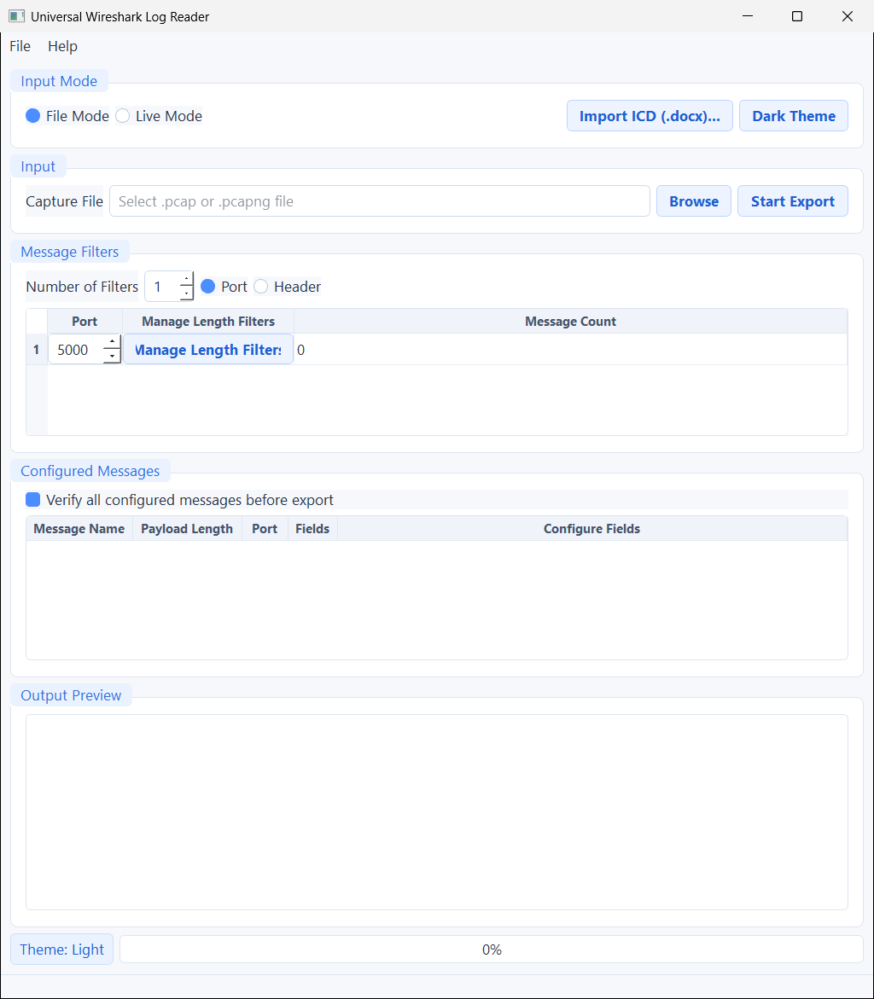

From top to bottom, here is what every area is for:

| Area | What it's for |
|---|---|
| **Menu bar (File, Help)** | Save/open your work, import a Word ICD, and view keyboard shortcuts. |
| **Input Mode** | Switch between **File Mode** and **Live Mode**. Also holds the **Import ICD (.docx)…** button and the **theme** button (top-right). |
| **Input** | The recording file you want to read, a **Browse** button to pick it, and a **Start Export** button to run the job. |
| **Message Filters** | How the program decides which packets to look at: by **Port** number or by a **Header** signature, and how many filter rows you want. |
| **Configured Messages** | The list of messages you've described for the selected filter, each with a **Configure Fields** button. |
| **Output Preview** | A live preview table that fills up with sample rows while a job runs. |
| **Status bar (bottom)** | A short message telling you what's happening, plus a progress bar. |

> **Tip:** The window is tall. If the bottom is cut off on a small screen, make the window
> taller or scroll — every control still works.

---

## 3. Light and dark themes

The program comes in a bright **Light** theme (the default, friendly for most people) and a
**Dark** theme (easier on the eyes in a dark room).

- The button in the **top-right** of the **Input Mode** area switches themes.
- The button shows the theme you will switch **to**. So when it says **"Dark Theme"**, you are
  currently in Light; click it to go dark.
- You can also press **Ctrl + T** at any time.
- Your choice is remembered the next time you open the program.

Here is the same window in the Dark theme:

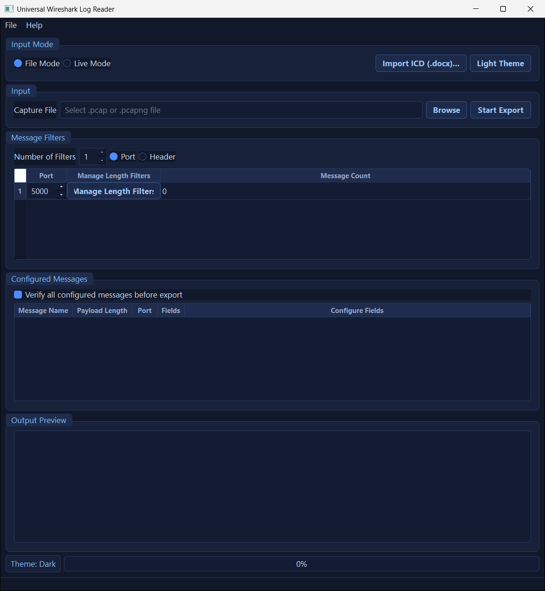

Use whichever you prefer — it changes only the colours, never how anything works.

---

## 4. The big idea: 3 simple steps

No matter which mode you use, the job is always the same three questions:

```
   ┌─ 1. WHERE do the packets come from? ─────────────┐
   │   • File Mode: a .pcap / .pcapng recording file  │
   │   • Live Mode: a live network port               │
   └──────────────────────────────────────────────────┘
                          │
   ┌─ 2. WHICH packets do I want? ────────────────────┐
   │   • Match by Port number + payload size          │
   │     (and, optionally, a "header" signature)      │
   │   • or by NMEA sentence type (GPS-style text)     │
   └──────────────────────────────────────────────────┘
                          │
   ┌─ 3. HOW are the bytes read? ─────────────────────┐
   │   • Fields: position, kind of number, size, scale│
   │   • plus optional flag-decoders and checks        │
   └──────────────────────────────────────────────────┘
                          │
                  ▶  Excel spreadsheet
                     (one file per message)
```

You can fill in steps 2 and 3 **by hand** (the dialogs below), or have the program fill them in
**automatically** by reading a **Word ICD** (see [Section 17](#17-import-a-word-icd-docx--define-everything-automatically))
or a **CSV/JSON** table (see [Section 18](#18-import--export-field-tables-csv--json)).

---

## 5. 5-minute Quick Start (from recording to Excel)

Let's do a complete job from start to finish so you can see how it all fits together. (This
example uses a recording with packets on port **5000** that are **32 bytes** long.)

**1) Make sure you are in File Mode.** The **File Mode** button (top-left) should be filled in.

**2) Pick your recording.** Click **Browse**, find your `.pcap`/`.pcapng` file, and open it. Its
path now appears in the **Capture File** box.

**3) Set the port.** In **Message Filters**, leave the matching style on **Port** and type the
port your packets use (e.g. `5000`) in the **Port** box of row 1.

**4) Describe a message.** Click **Manage Length Filters** on that row. In the window that opens,
click **Add Length Filter**, give the message a **name** and its exact **payload length in bytes**,
then click **Save**.

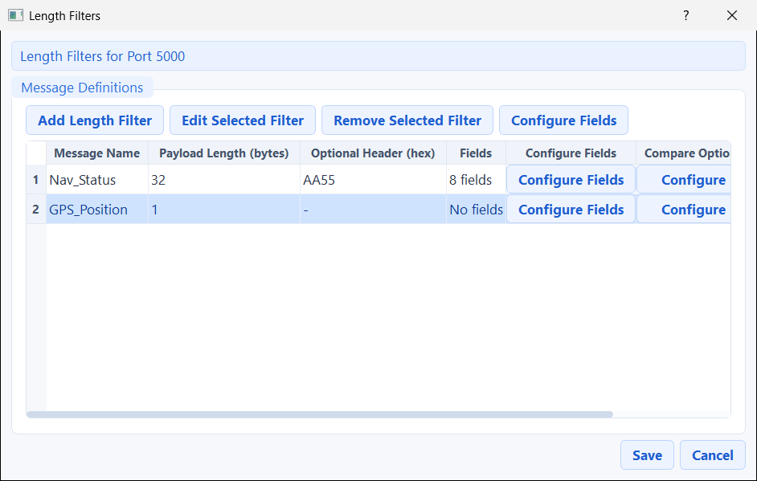

**5) Describe the fields.** Click **Configure Fields** on the message row, then add your fields
(name, position, kind of number, length, scale). In the picture below, eight fields have been
defined for a "Nav_Status" message:

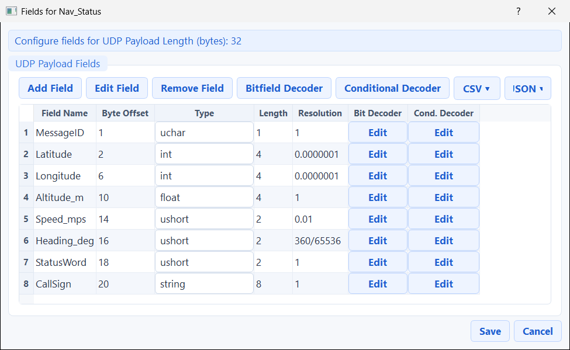

Click **Save** to close the field editor, then **Save** again to close the Length Filters window.

**6) Export!** Back on the main window, click **Start Export**. The program asks you to **choose a
folder** for the Excel files, then it runs. When it finishes, you get a summary:

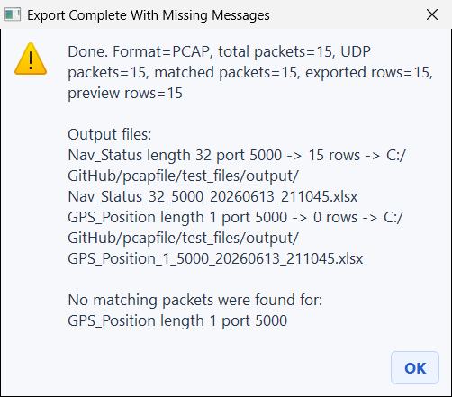

This summary tells you how many packets were read, how many matched your message, how many rows
were written, and exactly where each Excel file was saved.

**7) Look at the result.** The **Output Preview** on the main window fills with the rows it wrote:

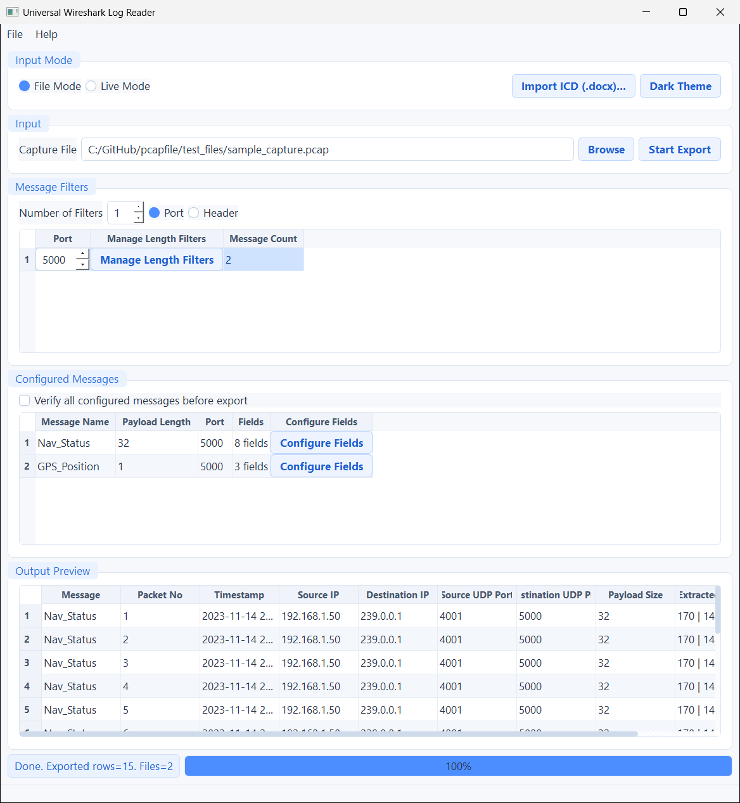

And here is the actual Excel file it created — one tidy column per field, one row per packet:

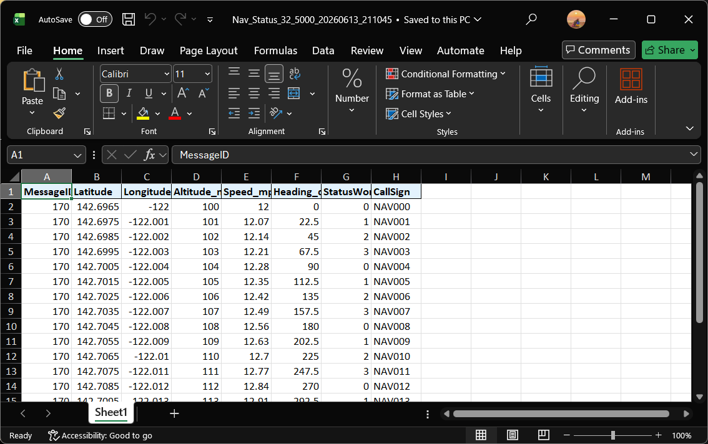

That's the whole idea! The rest of this manual explains each step in detail and shows you the
more powerful features.

---

## 6. Step 1 — Choose where the packets come from

At the very top, the **Input Mode** area has two choices:

- **File Mode** — read a recording file that already exists on your computer. This is the most
  common choice and is what most of this manual uses. *(Shortcut: Ctrl + 1.)*
- **Live Mode** — listen to packets arriving on the network in real time. See
  [Section 20](#20-live-mode--read-packets-straight-off-the-network). *(Shortcut: Ctrl + 2.)*

**In File Mode**, the **Input** area shows a **Capture File** box. Click **Browse** to pick a
`.pcap` or `.pcapng` file. *(Shortcut: Ctrl + B.)*

> **What's a .pcap file?** It's a recording of network traffic, usually made by a tool called
> **Wireshark**. `.pcap` and the newer `.pcapng` are both supported.

> **Tip:** If you saved your settings for this recording before (see
> [Section 19](#19-save-and-reload-your-work-projects)), the program offers to restore them
> automatically when you browse to the file. Say **Yes** to pick up where you left off.

---

## 7. Step 2 — Choose which packets you want (Port or Header)

The **Message Filters** area decides which packets the program will look at. Use **Number of
Filters** to create one or more independent filter rows, and pick a matching style with the
**Port** / **Header** buttons.

### Port mode (the usual choice)

Each row is a **port number**. The program looks only at packets sent to that port, and then
matches them to the messages you describe (by their size, and an optional header signature). This
is the default and the most common way to work.

### Header mode

Click the **Header** button to switch styles:

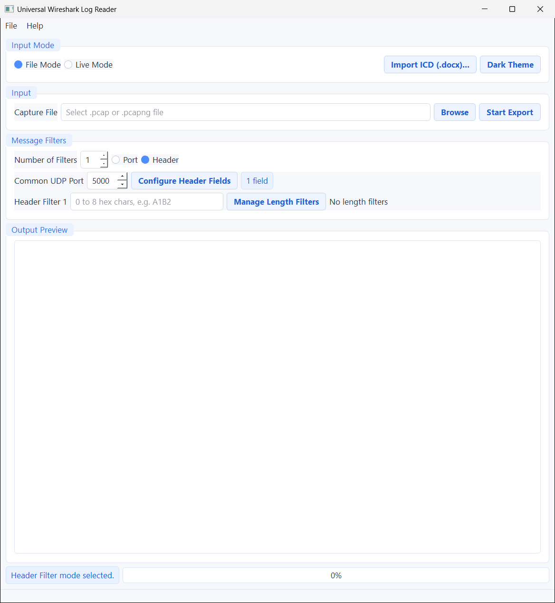

In Header mode, **all rows share one Common UDP Port**, and each row carries a short **header
signature** written in hex (for example `A1B2`). A packet matches a row when its payload **starts
with** those bytes. This is useful when many different messages arrive on the **same** port and
you tell them apart by their opening bytes.

- **Configure Header Fields** defines the fields for packets matched this way.
- **Manage Length Filters** lets you also attach size-based messages to a header row.

> **What's "hex"?** Hex (hexadecimal) is a way of writing byte values using the digits 0–9 and
> letters A–F. Each pair of hex characters is one byte. For example `A1B2` means two bytes:
> `A1` and `B2`. See the [Glossary](#23-glossary-every-word-explained).

---

## 8. Step 3 — Describe a message

A **message** is a named kind of packet with a known size. To manage the messages on a port, click
**Manage Length Filters** on that filter row. The **Length Filters** window opens:


It lists every message on that port. The columns are:

| Column | Meaning |
|---|---|
| **Message Name** | A friendly name you choose (it becomes part of the Excel file name). |
| **Payload Length (bytes)** | The exact payload size that identifies this message. |
| **Optional Header (hex)** | A signature so two same-size messages can be told apart (see below). |
| **Fields** | How many fields you've defined so far. |
| **Configure Fields** | Opens the field editor for this message. |
| **Compare Options** | Opens the optional verification checks (see [Section 15](#15-compare-options-checking-the-data-is-correct)). |

Buttons: **Add Length Filter** (new message), **Edit Selected Filter**, **Remove Selected Filter**,
and **Configure Fields**.

### The message editor

Click **Add Length Filter** (or **Edit Selected Filter**) to open the editor:

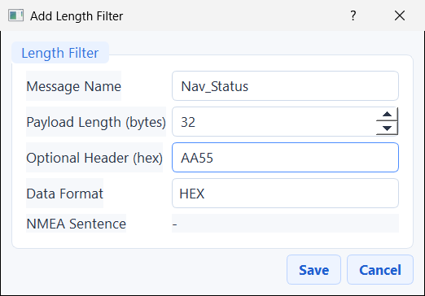

| Box | What to put in it |
|---|---|
| **Message Name** | A unique, friendly name, e.g. `Nav_Status`. |
| **Payload Length (bytes)** | The exact number of bytes in this message's payload. |
| **Optional Header (hex)** | *(Optional)* 0–8 hex characters. When set, the payload's first bytes must match this — handy when **two messages on one port have the same size** but different opening bytes. Leave it blank if you don't need it. |
| **Data Format** | **HEX** (read by byte positions — the normal choice) or **NMEA** (read a GPS-style text sentence — see [Section 16](#16-nmea-messages-gps-style-text-sentences)). |
| **NMEA Sentence** | Only used when Data Format is NMEA. |

The **Data Format** box is a dropdown with two choices:

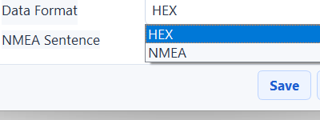

Click **Save** to add the message to the list.

---

## 9. Step 4 — Describe the fields inside a message

This is where you tell the program how to read the bytes. Open the field editor with **Configure
Fields**:


Each **row is one field** — one column in your final spreadsheet. The columns are:

| Column | What to put in it |
|---|---|
| **Field Name** | The column heading in Excel (must be unique within the message). |
| **Byte Offset** | The position of the field's **first byte**. **The first byte of the payload is position 1.** |
| **Type** | The kind of number (see [Section 10](#10-data-types--the-list-of-kinds-of-number)). It's a dropdown inside the cell. |
| **Length** | How many bytes the field uses. Fixed for most number types; you choose it for `Raw Unsigned BE` and `string`. |
| **Resolution** | A scale applied to the raw number (see [Section 11](#11-resolution--turning-raw-numbers-into-real-units)). |
| **Bit Decoder** | An **Edit** button to split this number into named flags (see [Section 13](#13-bitfield-decoders-splitting-one-number-into-flags)). |
| **Cond. Decoder** | An **Edit** button for advanced flag decoding that depends on another field (see [Section 14](#14-conditional-bitfield-decoders)). |

The buttons across the top:

- **Add Field / Edit Field / Remove Field** — manage the rows. *(Keyboard: **Insert** adds a row,
  **Ctrl + E** edits, **Ctrl + Delete** removes.)*
- **Bitfield Decoder / Conditional Decoder** — open a decoder for the selected field.
- **CSV ▾** — import, export, or download a template field table as a CSV file.
- **JSON ▾** — import or export the whole field list (decoders included) as JSON.

The **Type** cell is a dropdown listing every available kind of number:

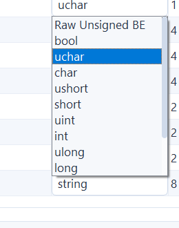

> **Tip:** You can also **drag and drop** a `.csv` or `.json` field file straight onto this window
> to load it. See [Section 18](#18-import--export-field-tables-csv--json).

When you close the editors, the main window's **Configured Messages** area lists everything you've
set up — here, two messages on port 5000, ready to export:

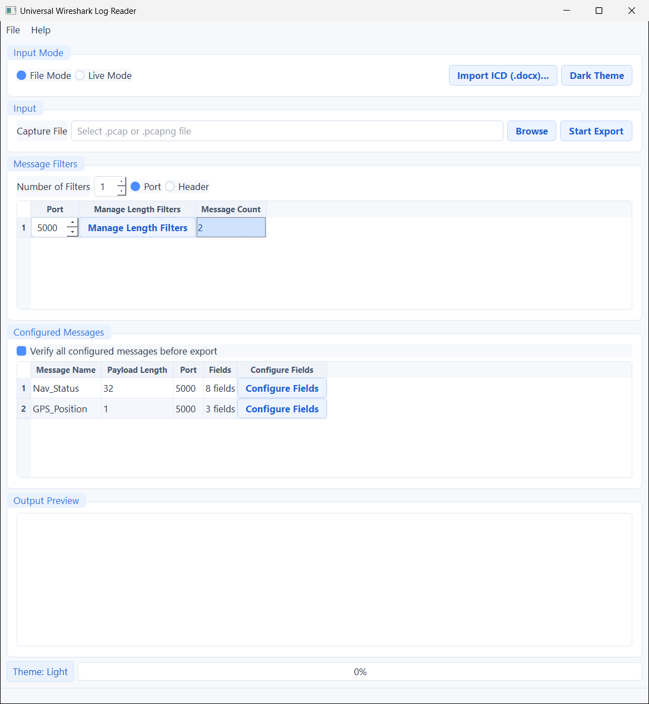

---

## 10. Data types — the list of "kinds of number"

The **Type** dropdown offers 13 kinds of value. "Kind of number" mostly means *how many bytes* the
value uses and *whether it can be negative or have decimals*.

| Type (label) | Size (bytes) | What it is |
|---|---|---|
| **Raw Unsigned BE** | you choose (1–8) | A plain whole number, never negative, of any width up to 8 bytes. |
| **uchar** (Uint8) | 1 | A whole number 0–255. |
| **char** (Int8) | 1 | A whole number −128…127. |
| **ushort** (Uint16) | 2 | A whole number 0–65 535. |
| **short** (Int16) | 2 | A whole number −32 768…32 767. |
| **uint** (Uint32) | 4 | A larger whole number, never negative. |
| **int** (Int32) | 4 | A larger whole number that can be negative. |
| **ulong** (Uint64) | 8 | A very large whole number, never negative. |
| **long** (Int64) | 8 | A very large whole number that can be negative. |
| **float** (Float32) | 4 | A number with decimals (single precision). |
| **double** (Float64) | 8 | A number with decimals (double precision). |
| **bool** | 1–8 | True/False. Zero becomes **false**; anything else becomes **true**. |
| **string** / **text** | you choose | Plain text. The program reads that many bytes as text. **Text can be longer than 8 bytes** (numbers can't). |

A few helpful notes:

- **"BE" / big-endian"** just means the most important byte comes first — the normal order for
  most equipment. You don't have to do anything; the program reads numbers this way.
- If a field's position and length run **past the end** of the payload, that cell shows `N/A`.
- Only number types can have bit decoders. Text (`string`) cannot.

---

## 11. Resolution — turning raw numbers into real units

Equipment often sends numbers as plain integers to save space. For example, a speed of **12.34
metres per second** might be sent as the whole number **1234**. **Resolution** is how you turn that
raw number back into the real value.

> **The rule:** `final value = raw number × Resolution`

You type the Resolution as a **number or a small formula**:

- A plain number, e.g. `0.01` (so 1234 becomes 12.34).
- A fraction or formula, e.g. `360/65536` (useful for angles), `1/1000`, or `2*pi`.
- It understands `+`  `-`  `*`  `/`  `(` `)` and the constants **`pi`** and **`e`**.
- Use `1` (the default) when you want the raw number unchanged.

> **Important:** the Resolution is **only a scale factor** — it is *not* a formula about the byte
> value. Don't write things like `raw*0.01`; just write the scale itself, e.g. `0.01`. There is no
> `raw` keyword.

In the field editor above, the **Heading_deg** field uses `360/65536`, which neatly converts a
2-byte angle into degrees. You can see the effect in the exported Excel file (Heading steps
0, 22.5, 45, 67.5, 90 …):


---

## 12. Step 5 — Export and read your Excel file

When your messages and fields are ready:

1. *(Optional but recommended)* In **Configured Messages**, tick **"Verify all configured messages
   before export"**. The program first scans the recording and warns you if any message you
   described never actually appears — a great way to catch a wrong port or size before you wait for
   a big export. (Untick it for the fastest possible single pass on very large files.)
2. Click **Start Export** (or press **F5**).
3. The program asks you to **choose a folder**. It writes **one Excel file per message** into that
   folder.
4. A summary box reports the totals and the exact file paths:


While the job runs, the **Output Preview** table fills with sample rows and the status bar shows a
progress bar:


### About the Excel files

- You get **one `.xlsx` file per message**, named like
  `MessageName_Length_Port_Date_Time.xlsx` (e.g. `Nav_Status_32_5000_20260613_211045.xlsx`).
- Each file has a **bold heading row** with your field names, then **one row per matching packet**:


- If you turned on any **Compare Options** ([Section 15](#15-compare-options-checking-the-data-is-correct)),
  extra checking columns are added after your fields.
- The on-screen **Output Preview** also shows packet details (packet number, time, addresses,
  ports, size). The saved Excel file contains your field columns.

> **Heads-up about Excel files:** the spreadsheet is written all at once when the job finishes.
> Two things to remember: (1) don't close the program in the middle of a long live capture, or the
> unfinished file is lost; and (2) **close the file in Excel before re-exporting** to the same
> name, or saving will fail because the file is locked.

---

## 13. Bitfield decoders (splitting one number into flags)

Sometimes a single number is really a bundle of small flags packed together — a "status word"
where bit 0 means one thing, bits 1–2 mean another, and so on. A **bitfield decoder** unpacks that
number into separate, named, human-readable columns.

> **What's a "bit"?** A byte is made of 8 **bits**, each either 0 or 1. Bits are numbered starting
> at 0. A "2-byte" number has bits 0–15.

Open it with the **Edit** button in the **Bit Decoder** column (or select a field and click
**Bitfield Decoder**). Here it is for a 2-byte "StatusWord" field:

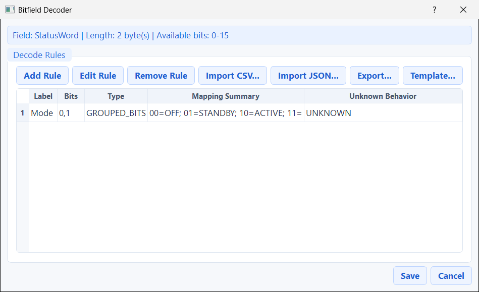

The heading reminds you which field you're decoding and which bit numbers are available
(`0–15` for 2 bytes). Each **rule** becomes one new column in Excel. Use **Add / Edit / Remove
Rule**, or the bulk **Import / Export / Template** buttons.

### Editing one rule

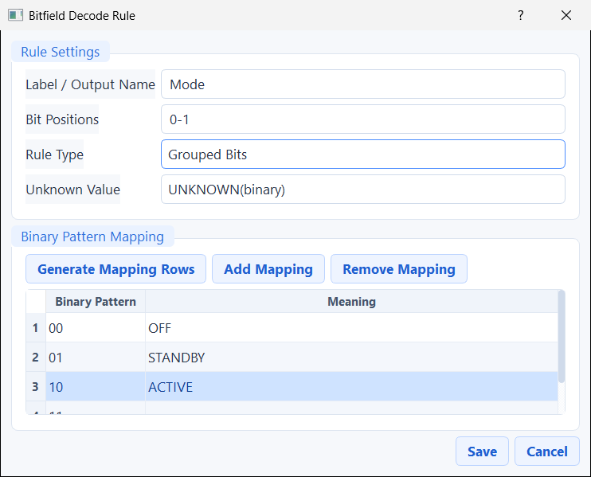

| Setting | What it does |
|---|---|
| **Label / Output Name** | The name of the new Excel column (e.g. `Mode`). |
| **Bit Positions** | Which bits this rule reads — one bit (`5`), a list (`1,3,5`), or a range (`0-1`). |
| **Rule Type** | **Single Bit** (exactly one bit) or **Grouped Bits** (several bits read together). Choose **Grouped Bits** when you list more than one bit. |
| **Unknown Value** | What to write when a value has no meaning in your table (show `UNKNOWN`, leave blank, or show the raw binary). |
| **Binary Pattern Mapping** | The lookup table: each bit pattern → a meaning. In the picture, `00 → OFF`, `01 → STANDBY`, `10 → ACTIVE`. The **Generate Mapping Rows** button fills in every possible pattern for the bits you chose, so you only have to type the meanings. |

> **Tip:** If you pick more than one bit but leave Rule Type on "Single Bit", the program reminds
> you to switch it to **Grouped Bits**.

---

## 14. Conditional bitfield decoders

This is an advanced version of the bit decoder. A **conditional** decoder chooses **which set of
rules to apply** based on the value of *another* field — called the **controller**. This is for
messages where one byte changes the meaning of the rest (for example, a "message subtype" byte).

Open it with the **Edit** button in the **Cond. Decoder** column:

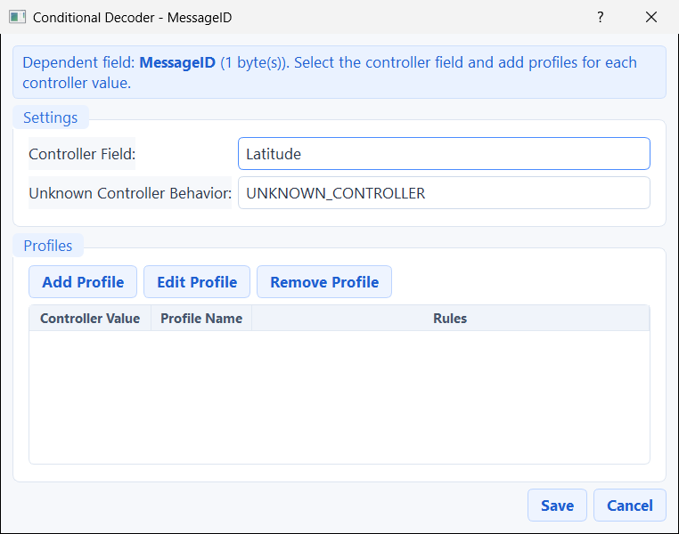

- **Controller Field** — the field whose value decides which rules to use.
- **Unknown Controller Behavior** — what to do when the controller's value matches none of your
  profiles.
- **Profiles** — each profile is "when the controller equals *this* value, use *these* bit rules".
  Add, edit, or remove profiles here. Each profile has its own little bit-decoder table just like
  [Section 13](#13-bitfield-decoders-splitting-one-number-into-flags).

If this sounds complicated, you probably don't need it — most messages only need plain fields and
ordinary bit decoders.

---

## 15. Compare Options (checking the data is correct)

**Compare Options** add **checking columns** to your Excel file so you can confirm the packets are
framed and read correctly. Open them with the **Configure** button in the **Compare Options**
column of the Length Filters window:

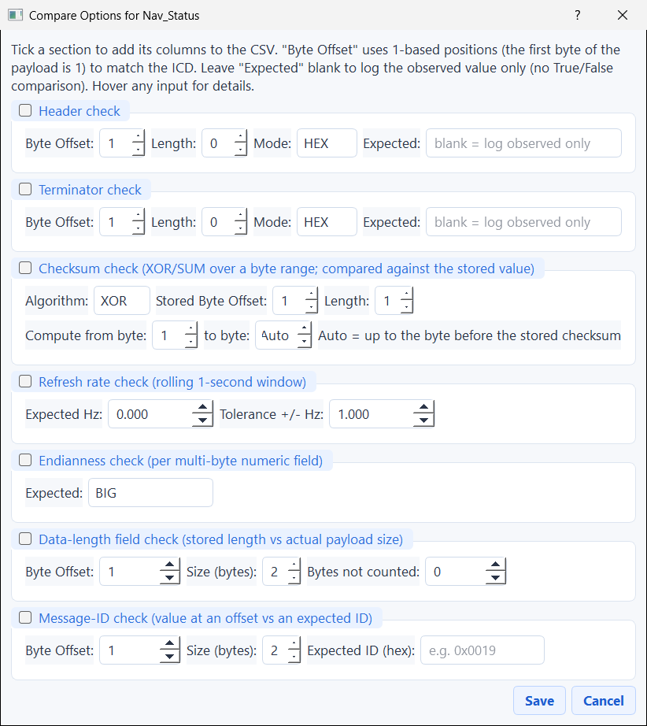

**Tick a section to switch its check on.** If you leave the **Expected** value blank, the program
just records what it *observed* (no pass/fail). Every **Byte Offset** here also starts at 1.

| Section | What it checks | Columns it adds |
|---|---|---|
| **Header check** | The opening bytes match an expected hex value. | `HeaderObserved` (+ Expected/OK) |
| **Terminator check** | The closing bytes match an expected value. | `TerminatorObserved` (+ Expected/OK) |
| **Checksum check** | A maths total (XOR or SUM) over a range of bytes matches the stored checksum. | `ChecksumComputed`, `ChecksumStoredInPayload`, `ChecksumOK` |
| **Refresh rate check** | How often the message arrives (per second) is close to an expected rate. | `RefreshRateObservedHz` (+ Expected/OK) |
| **Endianness check** | Shows each multi-byte number read both byte-orders so you can eyeball which is right. | `<field>_BE`, `<field>_LE` (+ OK) |
| **Data-length field check** | A "length" value inside the payload matches the real payload size. | `DataLenStored`, `DataLenComputed`, `DataLenOK` |
| **Message-ID check** | A value at a chosen position matches an expected ID (typed in hex). | `MsgIdObserved`, `MsgIdExpected`, `MsgIdOK` |

> **What's a checksum?** A small number stored in the packet that is calculated from the other
> bytes. If you recalculate it and get the same number, the data probably wasn't corrupted.

The last two checks (Data-length and Message-ID) are off by default and are handy for catching
mistakes when you've set up a message from a generic ICD.

---

## 16. NMEA messages (GPS-style text sentences)

Some equipment (especially GPS and marine gear) doesn't send raw bytes — it sends short **lines of
text** called **NMEA 0183 sentences**, like:

```
$GPGGA,123519,4807.038,N,01131.000,E,1,08,0.9,545.4,M,...*47
```

These are comma-separated. To read one, set a message's **Data Format** to **NMEA**. The program
then shows a **sentence picker**:

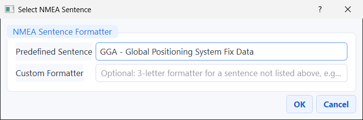

- **Predefined Sentence** — choose from a built-in list of **87** standard NMEA sentence types
  (GGA, RMC, and many more). You can type the 3-letter code to jump to it.
- **Custom Formatter** — or type your own 3-letter code for a sentence not in the list.

After you pick one, the message editor shows it:

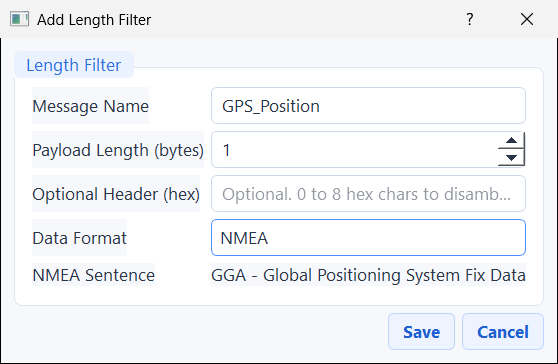

NMEA messages are matched by their **sentence type** (the port still applies, but exact byte size
and header don't). When you click **Configure Fields**, you get the **NMEA field editor** instead
of the byte editor:

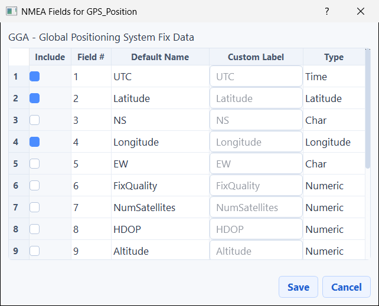

Here, fields are picked by their **position between commas** (the "Field #" column) instead of byte
offsets. For a known sentence the program already knows the fields: just **tick Include** for the
ones you want, optionally type a friendlier **Custom Label**, and the **Type** (Time, Latitude,
Numeric, Text…) is filled in for you. One Excel row is written per sentence.

---

## 17. Import a Word ICD (.docx) — define everything automatically

This is the biggest time-saver. If you have an **ICD** — a Microsoft Word document that describes
your messages in **tables** — the program can read those tables and create the messages and fields
for you, instead of typing them all by hand.

Start it with **File → Import ICD (.docx)…** (or **Ctrl + I**, or the **Import ICD (.docx)…**
button). Pick your `.docx` file, and this window opens:

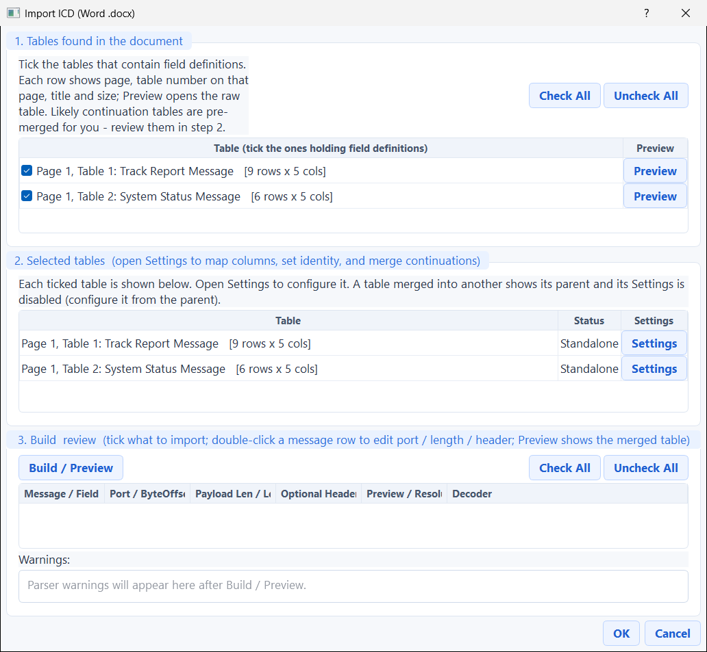

The window works in **three numbered boxes**, top to bottom:

### Box 1 — Tables found in the document
Every table the program found is listed, with its page, title, and size. **Tick the tables that
hold field definitions.** Use **Check All / Uncheck All** to select quickly, and **Preview** to
peek at any table's raw contents before deciding.

### Box 2 — Selected tables (open Settings to map columns)
Each ticked table appears here. Click its **Settings** button to tell the program which column is
which:

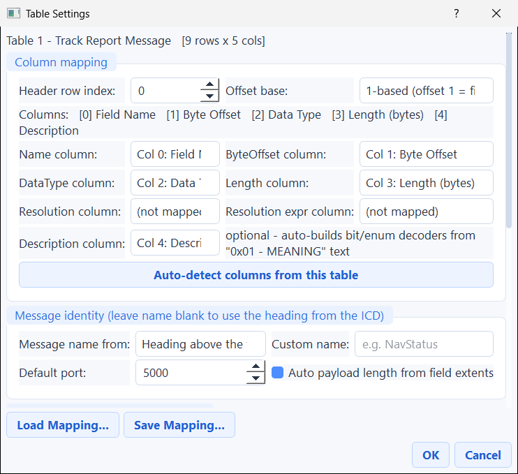

- **Column mapping** — choose the **header row**, whether offsets start at **0 or 1**, and which
  columns are the **Name / Byte Offset / Data Type / Length / Resolution**. The **Description**
  column can even build flag-decoders automatically from text like `0x01 - MEANING`.
- **Auto-detect columns from this table** — the program *guesses* the mapping for you (it reads the
  content; there's no AI and nothing is sent anywhere). In the picture it correctly found all five
  columns. You can always override its guess.
- **Message identity** — the message name (blank uses the Word heading) and a default **port**.
- **Load / Save Mapping** — reuse a mapping you set up earlier on a similar document.

### Box 3 — Build & review
Click **Build / Preview** to assemble everything into a checkable tree of messages and fields:

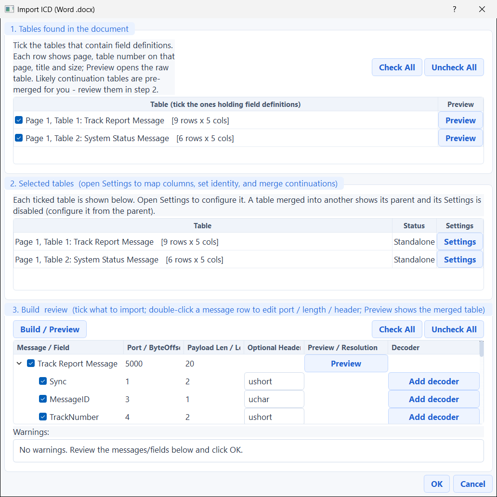

- Every message and field has a **tick box** — untick anything you don't want.
- Anything the program was unsure about is **left blank for you to fix**, never silently dropped,
  and is explained in the **Warnings** box at the bottom ("No warnings" here means a clean read).
- The **Data Type** of each field is a dropdown you can correct.
- The **Preview** button on a message shows the exact rows it read from the Word table:

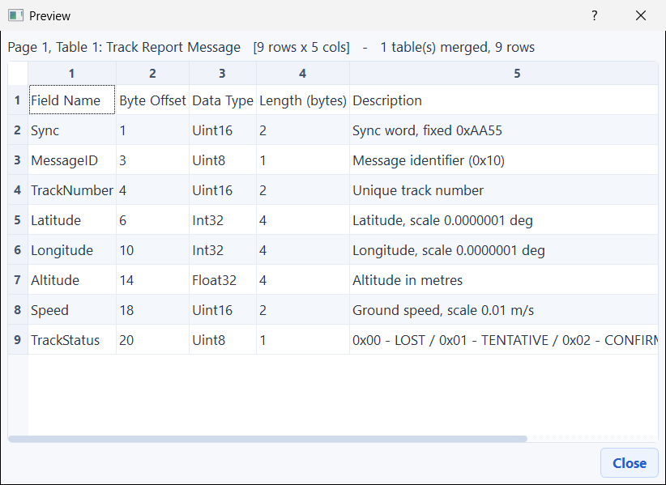

Click **OK** to finish. The messages drop straight into your current mode (the selected port,
header, or Live list) — exactly as if you'd typed them by hand — and they save with your project
like anything else.

---

## 18. Import / export field tables (CSV & JSON)

If you'd rather prepare your fields in a spreadsheet or a text file, the field editor can read and
write them.

In the field editor, the **CSV ▾** button has three choices:

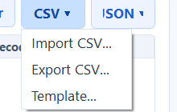

- **Template…** writes an empty CSV with the right column headings so you know the format.
- **Export CSV…** saves your current fields to a CSV.
- **Import CSV…** loads fields from a CSV. The columns are
  `Name, ByteOffset, DataType, Length, Resolution, ResolutionExpression`. Heading order doesn't
  matter, capitalisation doesn't matter, and blank or `#` lines are ignored.

When you import, the program tells you how many fields it found and asks whether to **Replace** your
current list or **Append** to it:

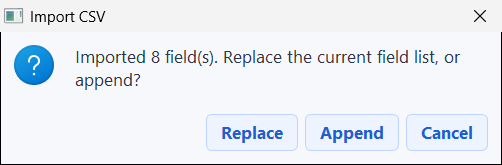

- **JSON ▾** does the same but in JSON format, and JSON **also keeps your bit decoders** (CSV does
  not). JSON is the best choice if you want to back up everything including decoders.
- If anything in the file is wrong, the program shows **all** the problems in one message and
  **leaves your current table untouched** — so a bad import never damages your work.

> **Tip:** You can drag a `.csv` or `.json` file from Windows Explorer straight onto the field
> editor to import it.

---

## 19. Save and reload your work (projects)

Setting up ports, messages, and fields takes effort — so save it! The **File** menu has:

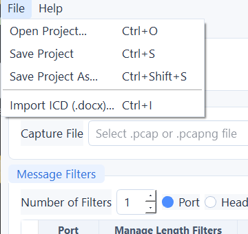

- **Open Project…** (Ctrl + O), **Save Project** (Ctrl + S), **Save Project As…** (Ctrl + Shift + S).
- A **project** remembers your **entire setup**: input mode, filters, every message and field (with
  decoders and Compare Options), live settings — everything.
- The project is saved as a small `.pcproj.json` file **next to your recording**. When you later
  browse to that recording, the program offers to restore the project automatically.
- Your work is also **auto-saved when you close** the program, so you rarely lose anything.
- You can **drag a `.pcproj.json` file** onto the main window to open it.

---

## 20. Live Mode — read packets straight off the network

Instead of a recording, Live Mode listens to packets arriving **right now**. Click **Live Mode**
(or press **Ctrl + 2**):

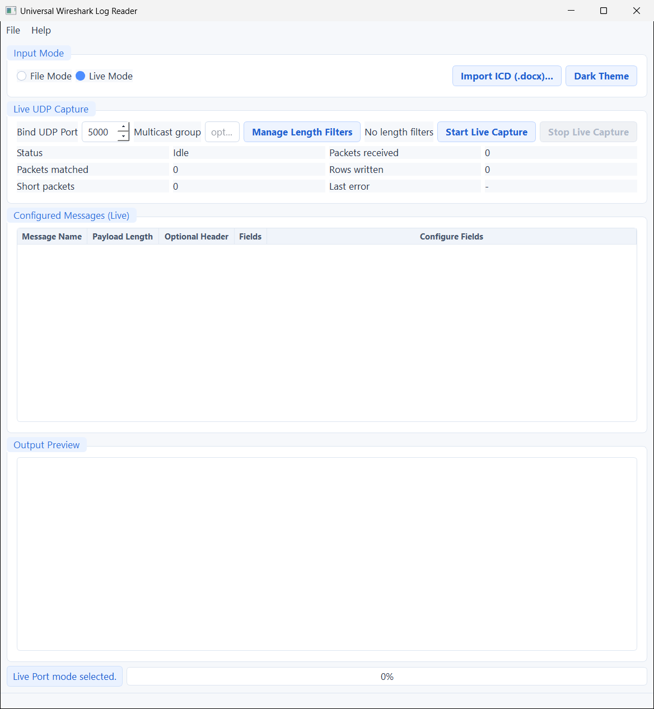

| Control | What it does |
|---|---|
| **Bind UDP Port** | The port number to listen on. |
| **Multicast group** | *(Optional)* a multicast address like `239.1.1.1` to join. Leave it blank for normal traffic. |
| **Manage Length Filters** | Describe the messages to capture — exactly like [Section 8](#8-step-3--describe-a-message). You need at least one before you can start. |
| **Start / Stop Live Capture** | Begin or end listening. When you start, you choose an output folder; one Excel file per message is written and kept up to date. |
| **Status grid** | Live counters: status, packets received, packets matched, rows written, short packets, and the last error. |
| **Configured Messages (Live)** | Your live message list, each with a **Configure Fields** button. |

> **Important for multicast:** if your packets go to an address like `239.x.x.x`, you **must** type
> it into **Multicast group**. A normal listen won't receive multicast traffic on its own.

Everything else — fields, bit decoders, NMEA, Compare Options — works in Live Mode exactly as in
File Mode.

---

## 21. Keyboard shortcuts

Press **F1** at any time — or use **Help → Keyboard Shortcuts** — to see this list inside the
program:

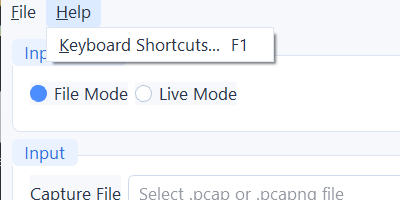

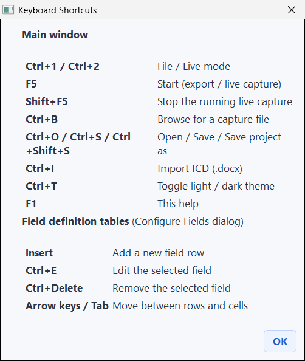

**Main window**

| Keys | Action |
|---|---|
| **Ctrl + 1 / Ctrl + 2** | Switch to File / Live mode |
| **F5** | Start (export, or live capture) |
| **Shift + F5** | Stop a running live capture |
| **Ctrl + B** | Browse for a recording file |
| **Ctrl + O / Ctrl + S / Ctrl + Shift + S** | Open / Save / Save Project As |
| **Ctrl + I** | Import an ICD (.docx) |
| **Ctrl + T** | Switch light / dark theme |
| **F1** | Show this help |

**Inside the field editor**

| Keys | Action |
|---|---|
| **Insert** | Add a new field row |
| **Ctrl + E** | Edit the selected field |
| **Ctrl + Delete** | Remove the selected field |
| **Arrow keys / Tab** | Move between rows and cells |

In any dialog, **Enter** usually means OK/Save and **Esc** means Cancel.

---

## 22. Troubleshooting (when something looks wrong)

| What you see | What it usually means / how to fix it |
|---|---|
| **No rows came out / 0 packets matched** | The message's **payload length** (or NMEA type) doesn't match any packet, or the **port** is wrong. Tick **"Verify all configured messages before export"** to check before a full run. |
| **A cell shows `N/A`** | The field's **position + length** runs past the end of the payload, or a number's length doesn't match its type. Remember **Byte Offset starts at 1**. |
| **Two different messages on one port get mixed up** | Give each one a different **Optional Header (hex)** signature so the program can tell them apart. |
| **Live capture receives nothing on a 239.x.x.x address** | Type that address into **Multicast group** so the program joins the group. |
| **Saving the Excel file failed** | The file is probably **open in Excel**. Close it, then export again. |
| **The ICD import "dropped" a field** | It didn't — unsure fields are kept **blank for review** and listed under **Warnings**. Fix the column mapping in **Settings**, correct the **Data Type** dropdown in the review tree, then **Build / Preview** again. |
| **My change to the program didn't appear** | If you rebuilt the program but launched an old copy from a different folder, you'll see the old one. Make sure you're running the freshly built `UniversalWiresharkLogReader.exe`. |

---

## 23. Glossary — every word explained

- **Big-endian (BE)** — a way of ordering the bytes of a number so the most important byte comes
  first. Most equipment uses this; the program reads numbers this way by default.
- **Bit** — the smallest piece of data: a single 0 or 1. Eight bits make one byte. Bits are
  numbered from 0.
- **Bitfield / flags** — a single number used as a bundle of separate yes/no or small values, one
  per bit or group of bits.
- **Byte** — a chunk of data holding a number from 0 to 255. A payload is a row of bytes.
- **Capture file** — a recording of network traffic; here a `.pcap` or `.pcapng` file.
- **Checksum** — a small number stored in a packet, calculated from the other bytes, used to check
  the data wasn't corrupted.
- **CSV** — "Comma-Separated Values", a simple table format that opens in Excel or any text editor.
- **Endianness** — the order in which the bytes of a multi-byte number are stored (big-endian or
  little-endian).
- **Field** — one meaningful value inside a payload (e.g. "Latitude"), made of one or more bytes.
- **Header** — the first bytes of a payload, often a fixed signature identifying the message.
- **Hex (hexadecimal)** — writing byte values using 0–9 and A–F. Each two hex characters are one
  byte (e.g. `AA` = 170).
- **ICD (Interface Control Document)** — a document (often Word) that describes the messages and
  fields a system uses.
- **JSON** — a structured text format the program uses to save settings and field lists.
- **Message** — a named kind of packet with a known size and a known set of fields.
- **Multicast** — a way of sending one packet to many listeners at once, using special addresses
  (often starting with `239.`). You must "join the group" to receive them.
- **NMEA 0183** — a text format for GPS and marine data, made of comma-separated "sentences".
- **Offset** — the position of a byte inside the payload. In this program the first byte is
  **position 1**.
- **Packet** — one small parcel of data sent over the network.
- **Payload** — the actual contents inside a packet — the bytes you want to read.
- **pcap / pcapng** — file formats for recorded network traffic (made by tools like Wireshark).
- **Port** — a numbered "mailbox" on a computer that packets are addressed to (e.g. 5000).
- **Project** — a saved copy of your whole setup (`.pcproj.json`).
- **Resolution** — a number you multiply the raw value by to get the real, scaled value.
- **UDP** — one common method of sending packets over a network. This program reads UDP packets.
- **Wireshark** — a popular free tool for recording and viewing network traffic; it makes the
  `.pcap` / `.pcapng` files this program reads.

---

*This manual and its screenshots were generated from the live program built with Qt 5.10.1. If you
are a developer, see [CLAUDE.md](../CLAUDE.md) and [PROJECT_MINDMAP.md](PROJECT_MINDMAP.md) for the
code-level details.*
