# Universal Wireshark Log Reader — User Manual

Universal Wireshark Log Reader is an offline desktop tool that **reads and decodes** UDP and TCP
data — from a captured **`.pcap` / `.pcapng`** file or a **live UDP / TCP** stream — into engineering
values, and exports the result to **CSV** or **Excel**. It is the receiver/parser companion to
*Universal Data Simulator* (the sender).

> Tip: press **F1** any time to open this manual, and use the search box at the top to jump straight
> to a **Common function** or a **Troubleshooting** entry.

---

## Using this manual

This manual is built into the app (**Help → User Manual**, or **F1**). The list on the left is a
clickable table of contents; the box at the top searches the whole manual — type a word like
`troubleshooting`, `live mode` or `bitfield` and press **Enter** (or **Next**/**Prev**) to step
through every match. The same content is also provided as `parser_manual.docx`.

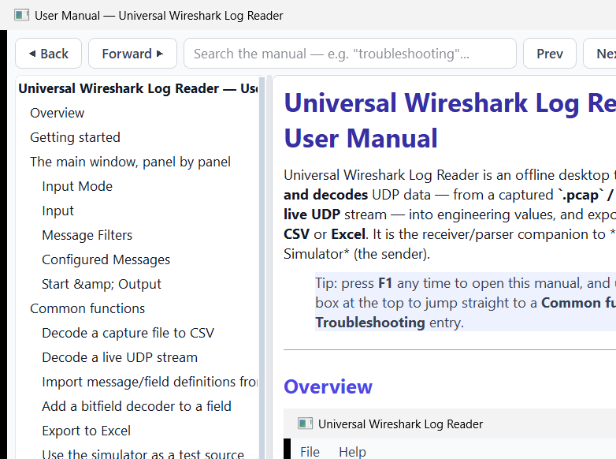

---

## Overview

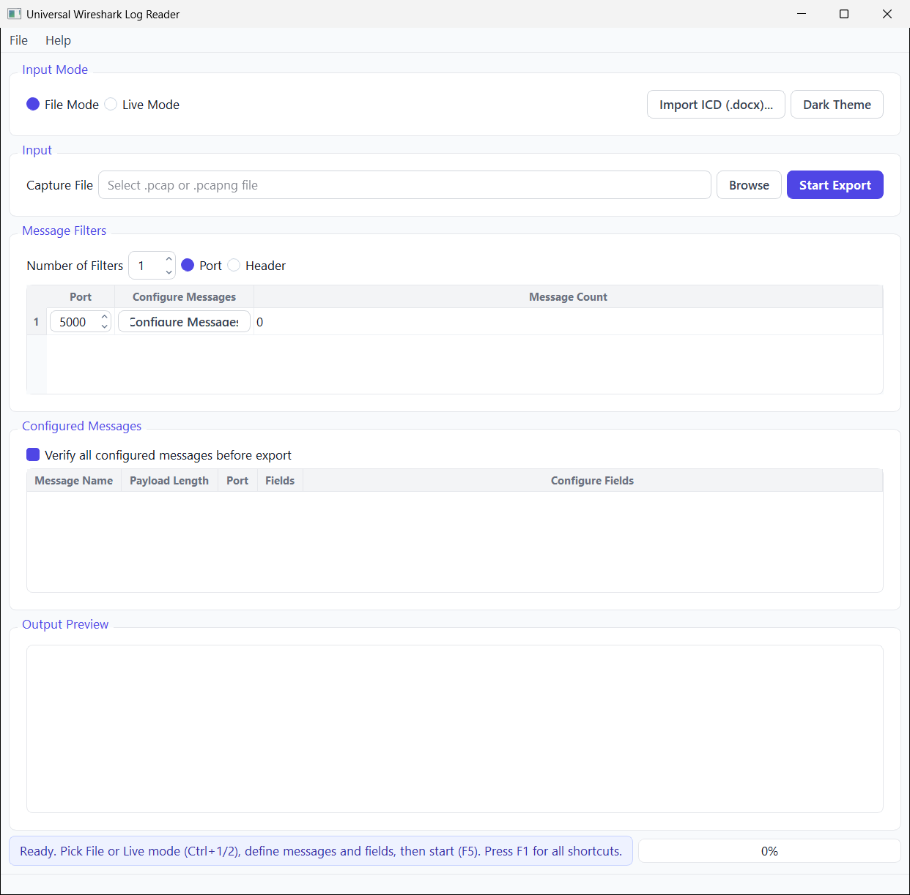

The window flows top to bottom:

1. **Input Mode** — *File Mode* (a saved capture) or *Live Mode* (listen to UDP/TCP now). Plus **Import ICD…**.
2. **Input** — choose the capture file (File Mode) or the listen/connect settings (Live Mode).
3. **Message Filters** — by **Port** and/or **Header**, with per-message **Length filters**.
4. **Configured Messages** — the message/field definitions that drive decoding.
5. **Start** — parse/decode and write the output.
6. **Output Preview** — a preview of the decoded rows.

The same window in the **Slate Dark** theme (toggle with **Ctrl+T**):

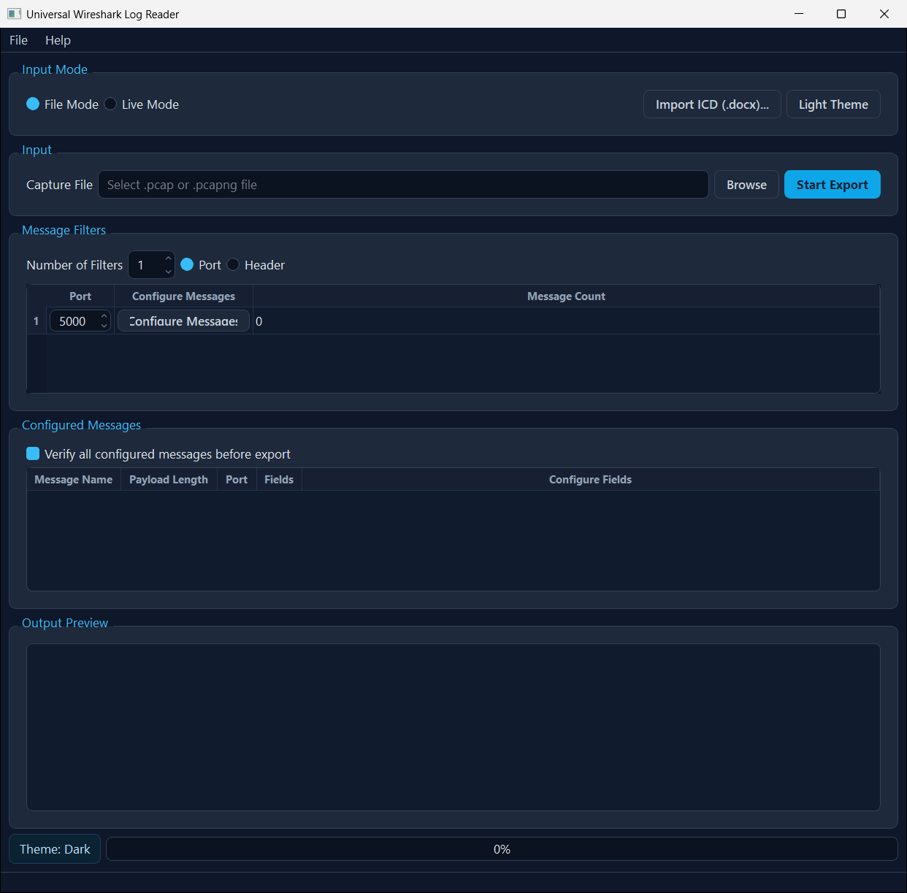

---

## Getting started

1. Choose **File Mode** (Ctrl+1) and **Browse** to a `.pcap`/`.pcapng` file — or **Live Mode**
   (Ctrl+2), pick **UDP** or **TCP** transport, and set the listen port (or TCP host/port).
2. Set a **Message Filter** (e.g. Port 5000) so only the traffic you care about is decoded.
3. Define one or more **messages** and their **fields** (name, byte offset, type, length, resolution),
   or **Import ICD…** to generate them from a Word document.
4. Press **Start** (F5). The **Output Preview** fills in and a CSV/Excel file is written.

After importing the sample ICD, the main window shows the configured messages ready to decode:

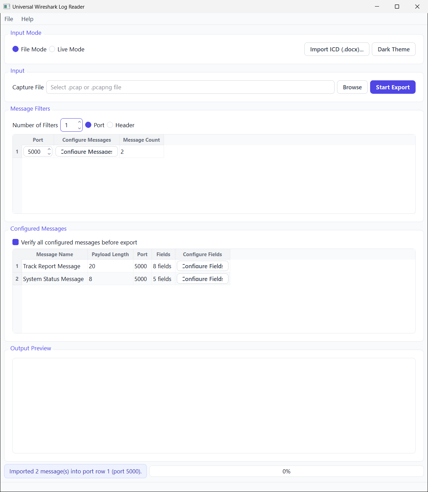

---

## The main window, panel by panel

### Input Mode
- **File Mode** (Ctrl+1) — decode a saved `.pcap`/`.pcapng` capture.
- **Live Mode** (Ctrl+2) — receive data live over the network and decode it as it arrives, writing
  per-message CSV files to a chosen folder.
- **Import ICD…** — build message/field definitions from a Word `.docx` ICD (see *Import from a Word ICD*).

### Input
*File Mode:* **Browse** to the capture file. *Live Mode:* either use the single **Transport** (UDP or
TCP) + listen port row, or press **Configure Connections…** to define several connections at once (see
below). For TCP you can also set the role (Server/Client), host and frame length before **Start Live**.

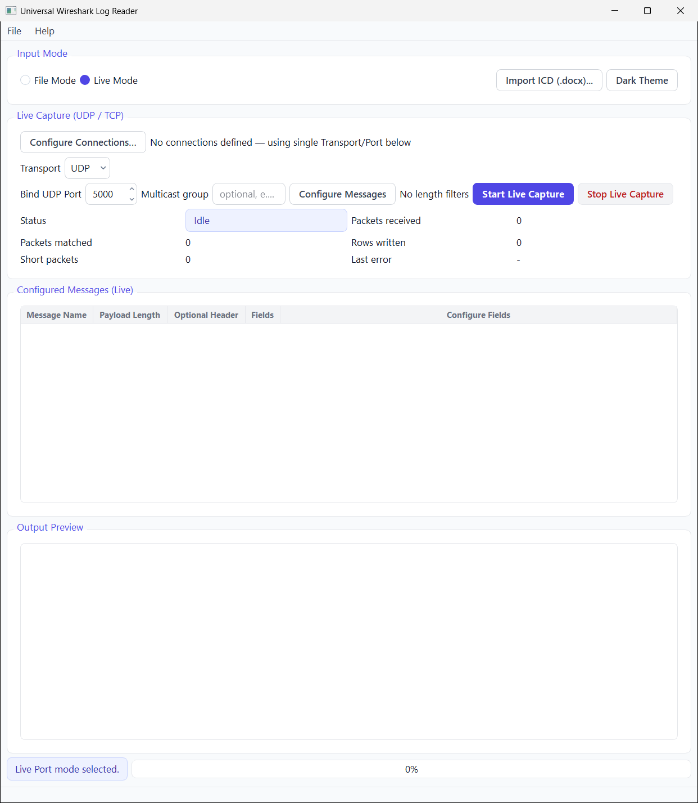

### Connections (Live Mode)
**Configure Connections…** opens a manager where you add, edit or remove receive connections. Each
connection picks a network **adapter** (chosen by number from the list, which always includes *Any
adapter* and *Loopback*) and a **port** — for UDP you never type an IP address, just the adapter and
port. TCP connections add a Listen/Connect role. When one or more connections are defined, the reader
binds a separate receiver per connection on **Start Live** and decodes each message **only** against the
connection it is bound to, so traffic from different adapters/ports never gets mixed. Leave the list
empty to fall back to the single Transport/Port row.

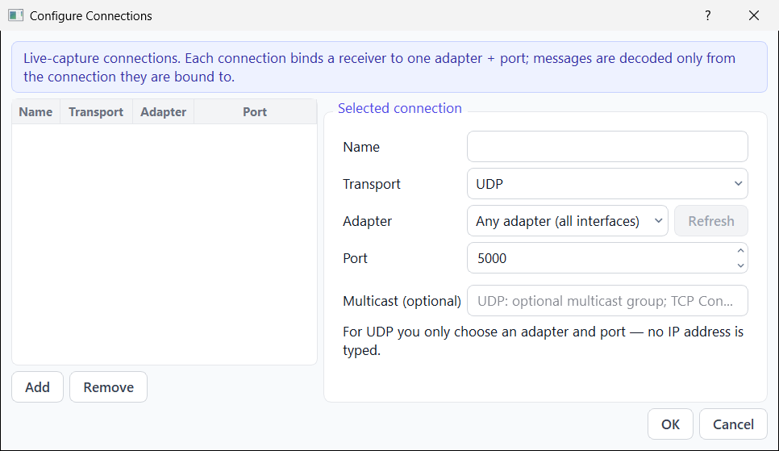

### Message Filters
Select **Port** or **Header** filtering and set the number of filters. Each filter row has a port and a
**Configure Messages** button (route messages by payload length) with a live message count. Header
filtering lets you tell apart same-length messages by a leading signature.

The **Configure Messages** dialog manages the message definitions on a port — add, edit, remove, and
import/export them as JSON, plus reach each message's fields and compare options:

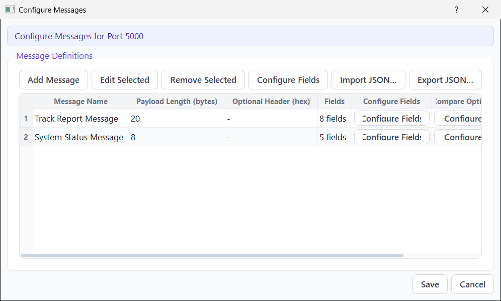

Each message's identity (name, payload length, optional header signature, data format) is edited in the
**Message Definition** dialog:

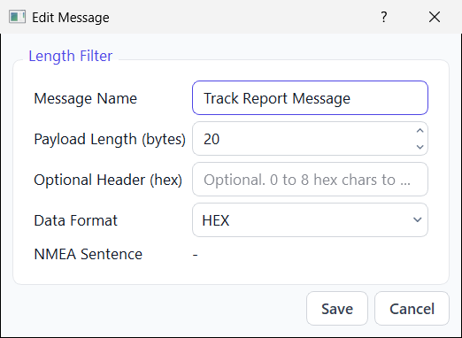

### Configured Messages
The list of messages to decode. Each has a name, payload length, port and fields. In Live Mode, when
connections are defined, a **Connection** column shows (and lets you set, via the Configure Messages
dialog) which connection each message is decoded from. **Configure Fields**
opens the field editor (name, 1-based byte offset, data type, length, resolution / resolution
expression). An **Offsets in** selector lets you switch between **Bytes** and **Words** (1 word = 2
bytes) for display; field offsets are always stored in bytes internally. Fields can carry **bitfield
decoders** and **conditional bitfield decoders** that expand a byte/word into named bit meanings. Tick
**Verify all configured messages before export** to validate everything first.

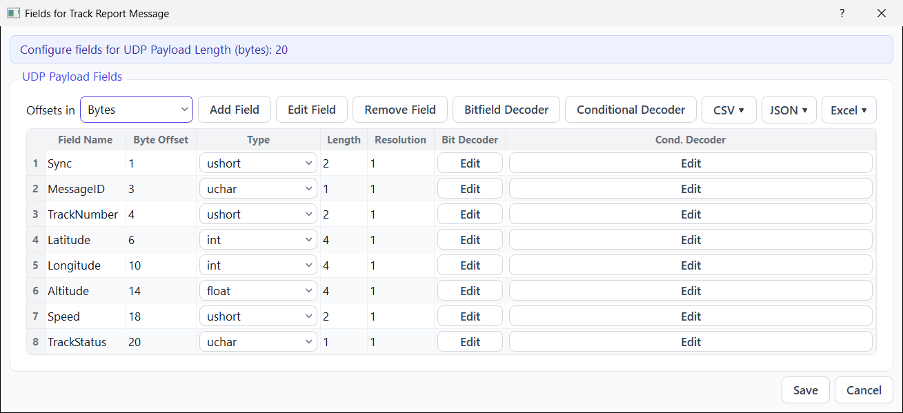

There is no length cap on numeric fields — fields wider than 8 bytes are decoded to exact decimal
values (or resolution-scaled doubles).

### Start and Output
**Start** (F5) parses the input, applies the filters, decodes each message's fields and writes the
output (CSV, or Excel via the export options). The **Output Preview** shows a sample of the decoded
rows. In Live Mode, **Stop** (Shift+F5) ends the capture.

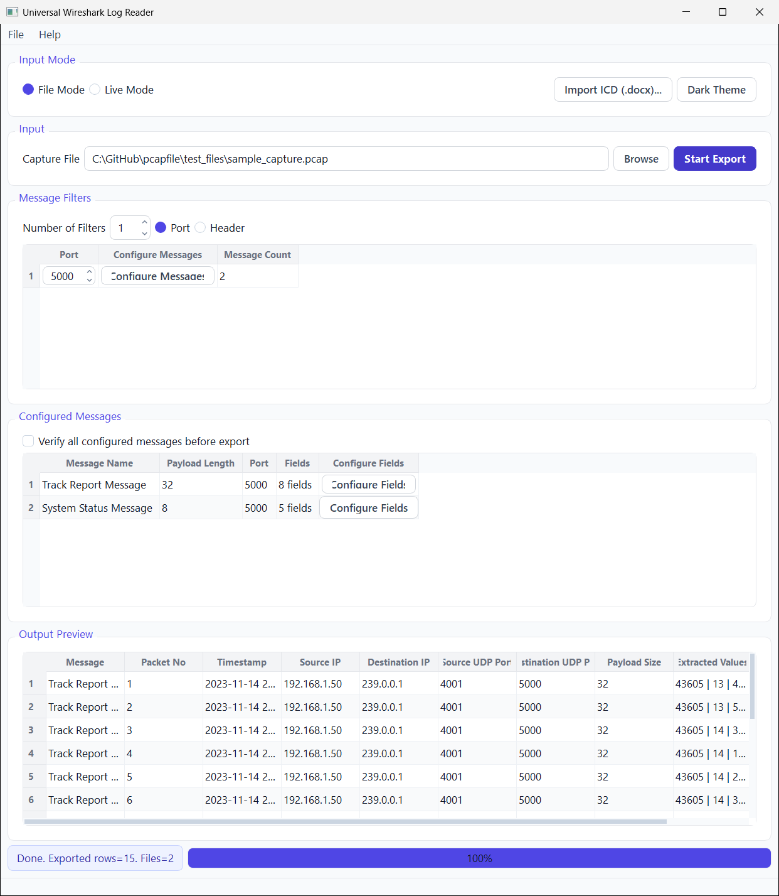

---

## Common functions

### Decode a capture file to CSV
1. **File Mode** (Ctrl+1) → **Browse** to the `.pcap`/`.pcapng`.
2. Add a **Port** filter (e.g. 5000) and define the message + fields (or **Import ICD…**).
3. **Start** (F5). The decoded rows appear in the preview and a CSV is written.

### Decode a live UDP stream
1. **Live Mode** (Ctrl+2) → transport **UDP** → set the listen **port**.
2. Define messages/fields and (optionally) per-message **length filters**.
3. **Start Live**, pick an output folder; one CSV per message is written as datagrams arrive. **Stop** when done.

### Decode a live TCP stream
1. **Live Mode** (Ctrl+2) → transport **TCP**.
2. Choose a **Role**: *Server* (listen for incoming connections) or *Client* (connect to a remote host).
   Set the port (and host for Client mode). Set the **Frame length** so the reader knows where one
   message ends and the next begins.
3. Define messages/fields → **Start Live**. TCP data is framed and decoded the same way as UDP.

### Receive from multiple sources at once (connections)
1. **Live Mode** (Ctrl+2) → **Configure Connections…** → **Add** one connection per source.
2. For each, pick the **adapter** (by number; *Any* and *Loopback* are always listed) and the **port**;
   for UDP that is all — no IP address. For TCP also pick Listen or Connect.
3. Press **Configure Messages**, and in the **Connection** column bind each message to the connection it
   should be decoded from (leave a message on *(any connection)* to accept it from all of them).
4. **Start Live** — one receiver runs per connection and each message is only matched on its connection,
   so two sources on different adapters/ports are kept completely separate.

### Import/export messages while configuring (JSON)
Inside the **Configure Messages** dialog, **Import JSON…** appends message definitions from a JSON file
and **Export JSON…** writes the current list out — the same format the simulator and the File menu use.

### Import message/field definitions from a Word ICD
See the dedicated **Import from a Word ICD** section below.

### Add a bitfield decoder to a field
In **Configure Fields**, select the field and press **Bitfield Decoder** (or the **Edit** button in the
field's *Bit Decoder* column). Define one or more rules — a label, the bit positions, the rule type and
the meaning of each pattern. On export, the field expands into readable per-bit columns.

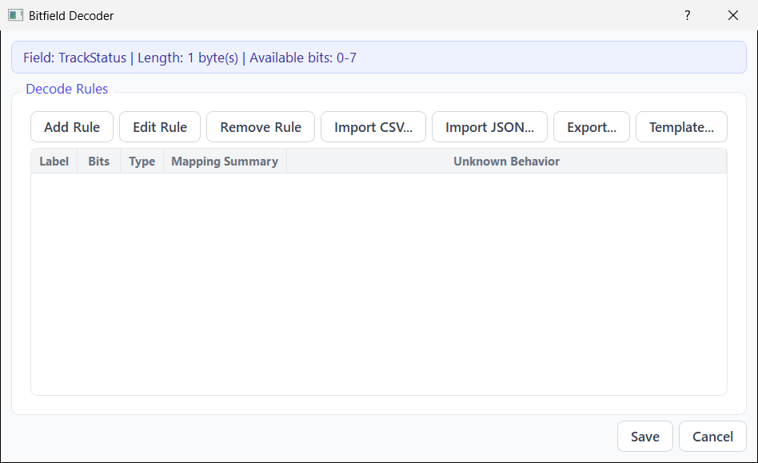

Each rule is edited in its own dialog (label, bit positions, rule type, and the binary-pattern → meaning
mapping):

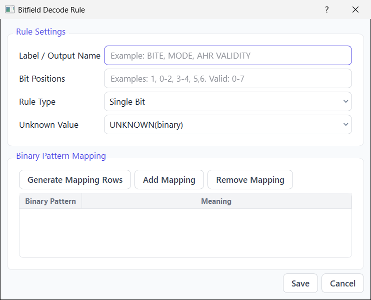

**Conditional** decoders switch the bit meanings based on a controller field's value — choose the
controller field, then add a profile (a set of rules) per controller value:

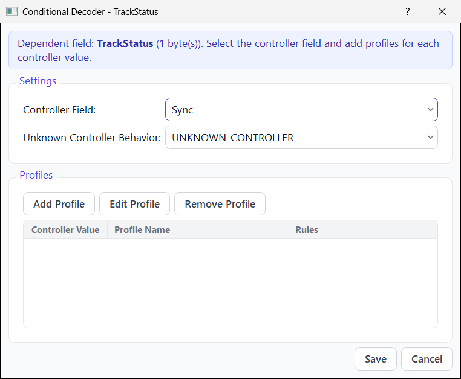

### Export to Excel
Use the export options to write `.xlsx` instead of CSV (one sheet per message). See the Excel export
notes for carrying the bundled library to another PC.

### Import/export fields as Excel
In **Configure Fields**, use the **Excel** menu → **Import** to load fields from a `.xlsx` file (same
column layout as CSV: Name, ByteOffset, DataType, Length, Resolution, etc.), or **Export** to write the
current fields to Excel. Bit decoders are not carried in the spreadsheet — use JSON for those.

### Import/export fields as JSON (lossless)
In **Configure Fields**, use the **JSON** menu → **Import** / **Export**. The JSON format carries the
full field definition including bitfield decoders, conditional decoders, and resolution expressions.

### Import/export whole messages as JSON
**File → Export Messages (JSON)** writes all configured messages (both modes) — fields, compare
options, payload length, port — to a single JSON file. **File → Import Messages (JSON)** loads them
back, appending to the current list (clashing names are auto-renamed). The format is shared with the
simulator, so you can round-trip definitions between the two apps without data loss.

### Switch offset display to Words
In **Configure Fields**, change the **Offsets in** dropdown from **Bytes** to **Words (2 bytes)**.
The offset column will display and accept word-based offsets (1 word = 2 bytes). The underlying byte
offsets are unchanged; this is purely a display convenience.

### Use the simulator as a test source
Run *Universal Data Simulator*, point it at this app's **Live Mode** port (UDP or TCP), and stream a
message — a quick way to validate your field definitions end to end.

---

## Import from a Word ICD

The reader can build complete message and field definitions straight from a Word **`.docx`** Interface
Control Document, so you never have to retype byte offsets, lengths and types by hand.

**1. Open the importer.** Press **Import ICD…** (Ctrl+I) and pick the `.docx`. The reader scans every
table in the document and opens the import dialog.

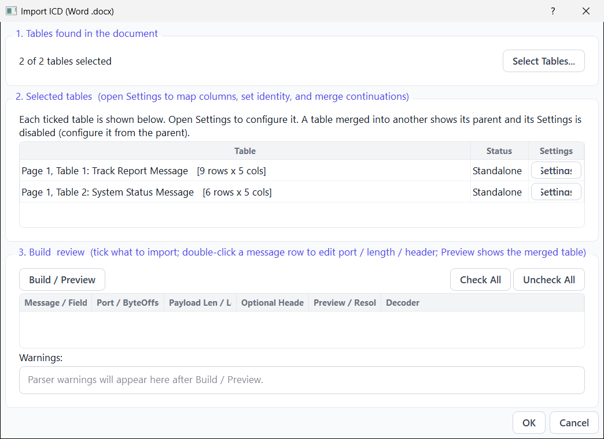

**2. Choose which tables to import.** Press **Select Tables…** to open the table picker. The left pane
lists every table in the document with a checkbox; the right pane renders the full table as a live
preview. Clicking a row scrolls the preview to it, and clicking a heading in the preview selects the
row. Likely field-definition tables are pre-ticked. Use **Check All** / **Uncheck All** and the summary
line at the bottom to confirm your selection, then press **OK**.

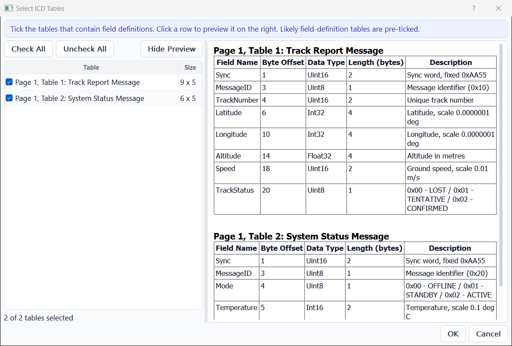

**3. Map the columns (if needed).** Each selected table appears in box 2. Open **Settings** on a table
to map its columns (Name, Byte Offset, Data Type, Length, Resolution, Description), set the **Offset
base** (0- or 1-based), choose where the **message name** comes from, and merge continuation tables.
**Auto-detect columns from this table** does its best guess automatically.

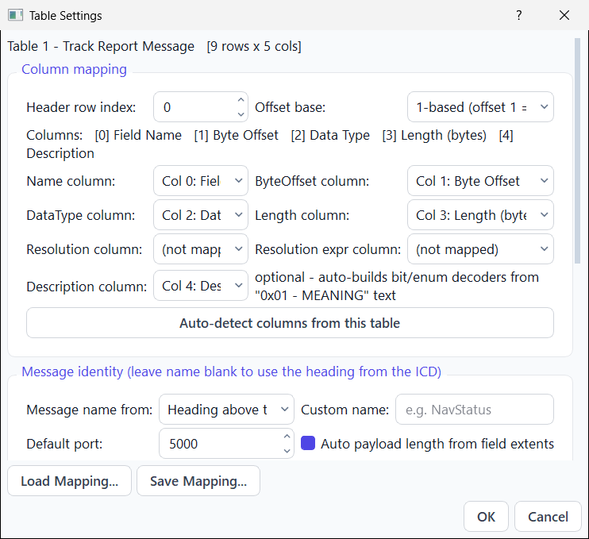

**4. Build & review.** Press **Build / Preview** to expand the tables into messages and fields. Review
(and edit) every value in the tree — double-click a message row to change its port, length or header;
the *Decoder* column shows decoders auto-derived from "0x01 - MEANING" description text. Any problems are
listed under **Warnings**.

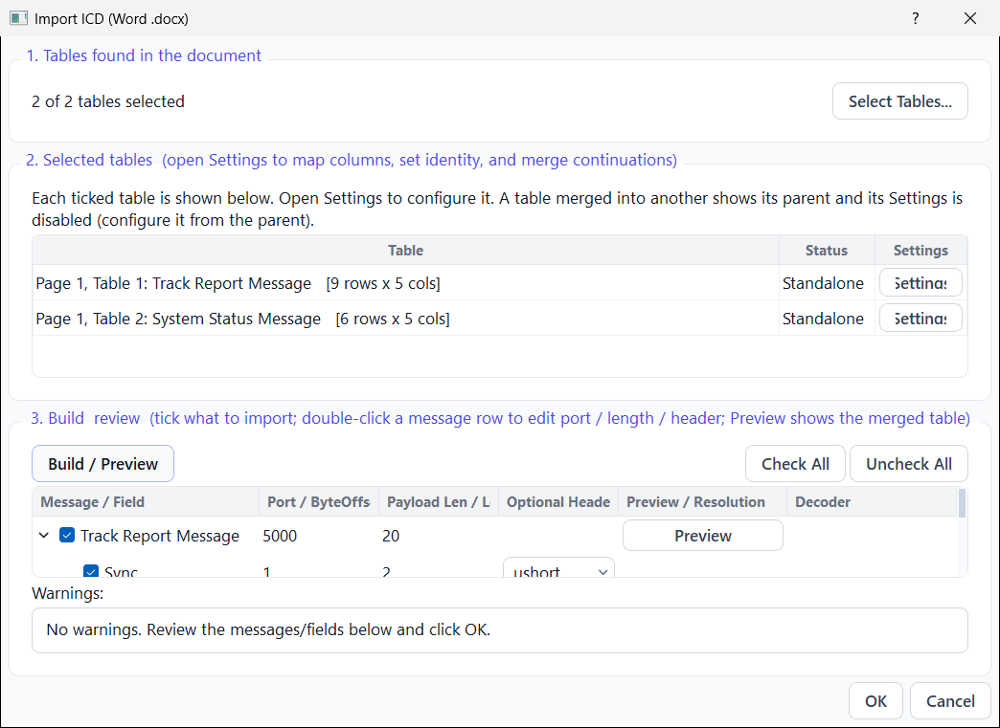

**5. Import.** Press **OK**. The drafted messages are added to *Configured Messages* (clashing names are
auto-renamed), ready to decode.

---

## Troubleshooting

| Symptom | Likely cause | Fix |
|---|---|---|
| "Please select a PCAP or PCAPNG file" | No/invalid capture chosen in File Mode | **Browse** to a real `.pcap`/`.pcapng` file. |
| No rows decoded | Filters exclude everything, or the wrong port | Check the **Port**/length filters match the traffic; widen or remove a filter to confirm. |
| "Message Not Found" on export | A configured message's length/port never appears in the capture | Match the message **Payload Length** and **Port** to the real packets, or untick **Verify all configured messages before export**. |
| Live Mode shows 0 messages (UDP) | Nothing arriving on that port, or firewall | Confirm a sender is transmitting to this PC's IP and the listen port; allow the app through the firewall. |
| Live Mode TCP won't connect | Wrong role, host, or port | Server mode listens; Client mode connects. Confirm the remote end is running and the host/port are correct. |
| Values look wrong / scaled oddly | Resolution or data type mismatch | Re-check each field's **Type**, **Length** and **Resolution**; confirm the byte offset (1-based). |
| Fields shifted by a byte | Wrong byte offset base or payload length | Byte Offset is **1-based**; verify the message **Payload Length** and each field's offset. |
| ICD import offsets look shifted by one | Offset base (0- vs 1-based) mis-detected | In the import's **Table Settings**, flip the **Offset base**; review offsets are editable. |
| ICD import found no/empty tables | Wrong tables ticked, or a non-table layout | Re-open **Select Tables…** and tick the tables that actually hold field rows; check the live preview. |
| Export fails / no file written | Output path not writable, or verify failed | Pick a writable folder; fix any issues from **Verify all configured messages**. |
| Two messages of equal length collide | Same length on the same port | Add a **Header** filter / optional-header signature to tell them apart. |
| App opened with mixed light/dark panels | One-time startup repaint (now auto-fixed) | If seen on older builds, toggle the theme (Ctrl+T) once; current builds re-apply on launch. |

---

## Keyboard shortcuts

| Shortcut | Action |
|---|---|
| F1 | Open this user manual |
| Shift+F1 | Keyboard shortcuts box |
| Ctrl+1 / Ctrl+2 | File Mode / Live Mode |
| F5 / Shift+F5 | Start / Stop |
| Ctrl+T | Toggle Light/Dark theme |
| Ctrl+O / Ctrl+S / Ctrl+Shift+S | Open / Save / Save-As project |
| Ctrl+I | Import ICD (.docx) |

---

## Glossary

- **PCAP / PCAPNG** — packet-capture file formats (e.g. from Wireshark/tcpdump).
- **UDP payload** — the application bytes of a UDP datagram, after the IP/UDP headers.
- **TCP frame** — a fixed-length chunk of a TCP byte stream; set the frame length to match one message.
- **Message filter** — a rule (by port, header signature and/or payload length) selecting which
  datagrams map to which message definition.
- **Byte offset** — 1-based position of a field's first byte within the payload.
- **Word offset** — 1-based position in 2-byte words; displayed when **Offsets in** is set to Words.
- **Resolution** — scale factor; the decoded engineering value is `raw × resolution`.
- **Bitfield decoder** — expands a numeric field into named per-bit meanings.
- **Conditional decoder** — a bitfield decoder whose meanings depend on a controller field's value.
- **Connection (Live Mode)** — a receiver bound to one adapter + port; messages are matched only on the
  connection they are bound to.
- **ICD** — Interface Control Document; here, a Word `.docx` describing message/field layouts.
