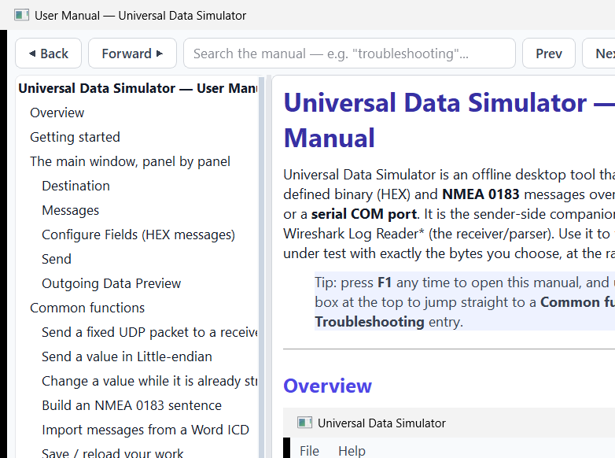
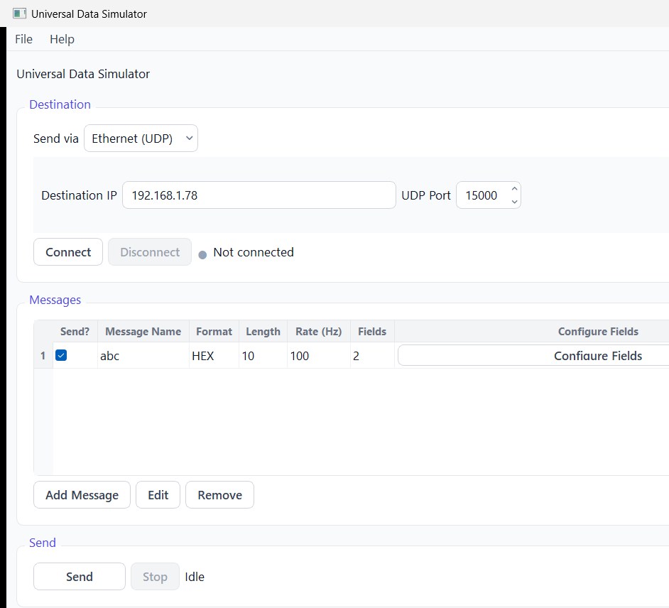
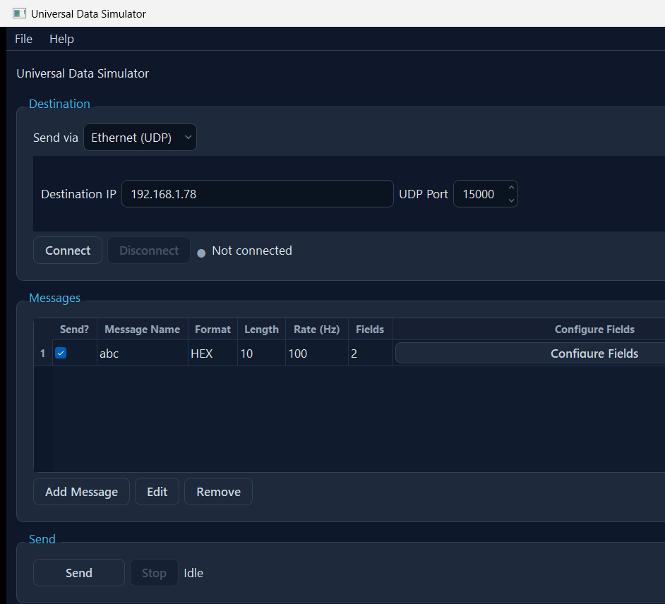

# Universal Data Simulator — User Manual

Universal Data Simulator is an offline desktop tool that **transmits** user-defined binary (HEX)
and **NMEA 0183** messages over **UDP**, **TCP**, or a **serial COM port**. It is the sender-side
companion to *Universal Wireshark Log Reader* (the receiver/parser). Use it to feed a system under
test with exactly the bytes you choose, at the rate you choose.

> Tip: press **F1** any time to open this manual, and use the search box at the top to jump
> straight to a **Common function** or a **Troubleshooting** entry.

---

## Using this manual

This manual is built into the app (**Help → User Manual**, or **F1**). The list on the left is a
clickable table of contents; the box at the top searches the whole manual — type a word like
`troubleshooting`, `endian` or `checksum` and press **Enter** (or **Next**/**Prev**) to step through
every match. The same content is also provided as `simulator_manual.docx`.

---

## Overview

The window is a single top-to-bottom flow:

1. **Connections** — press **Configure…** on the connection bar to define one or more send destinations
   (each UDP, TCP, or a serial COM port).
2. **Messages** — define one or more messages, each with its own fields, values, send rate, and the
   connection it is sent on.
3. **Send** — verify everything, open every needed connection, and stream every ticked message at its
   own rate until Stop.
4. **Outgoing Data Preview** — the last payloads handed to the link, in hex.

The same window in the **Slate Dark** theme (toggle with **Ctrl+T**):

---

## Getting started

1. Press **Configure…** on the connection bar. **Add** at least one connection and pick its transport —
   *UDP* (destination IP + port), *TCP* (host + port + Server/Client role), or *Serial* (COM port, baud,
   data bits, parity, stop bits). **Test Connection** confirms it opens and sends a health-check message.
2. Press **Add Message**, give it a name, payload length and send rate, then **Configure Fields**.
3. Type a **Value** for each field — the **Hex (auto)** column shows the exact bytes in real time.
4. In the message row's **Connection** column, choose which connection sends it (the first connection is
   the default for messages you leave unset).
5. Tick the message's **Send?** box and press **Send** (F5). The simulator opens each needed connection
   (the bar dot turns **green**) and streams. Watch the preview at the bottom.

---

## The main window, panel by panel

### Connections
The connection bar shows how many connections are defined; **Configure…** opens the manager. Each
connection has a **Name** and a **Transport**: **UDP** (destination IP + port), **TCP** (host + port +
Server/Client role), or **Serial** (COM port with baud / data bits / parity / stop bits; **Refresh**
re-scans the ports). **Test Connection** opens the link, sends a short health-check message and reports
OK / the failure reason, without starting a stream. The connections are not held open while you edit —
the simulator opens exactly the ones it needs when you press **Send**, and closes them on **Stop**. The
bar dot is **gray** when idle, **green** while sending, **red** if a link drops.

### Messages
Each row is a message: **Send?** tick, **Name**, **Format** (HEX or NMEA), payload **Length**,
**Rate (Hz)**, field count, a **Configure Fields** button and a **Connection** selector (which
destination the message is sent on; the first connection is the default).
- **Add Message / Edit / Remove** manage the list.
- **Import ICD…** reads a Word `.docx` ICD and turns its tables into ready-to-send messages.

### Configure Fields (HEX messages)
Columns: **Field Name · Byte Offset · Type · Length · Endian · Resolution · Value · Hex (auto) · Bits**.
- An **Offsets in** selector lets you switch between **Bytes** and **Words** (1 word = 2 bytes) for
  the offset column display; offsets are always stored in bytes internally.
- The **Value** is typed in the field's own type; the read-only **Hex (auto)** cell shows the exact
  bytes that will be sent and updates as you type (it turns red with a reason if the value does not fit).
- **Endian** sets Big-endian (default) or Little-endian per field (numeric fields only).
- **Bits…** opens a two-way bit editor — type a value or toggle individual bits.
- **CSV**, **JSON**, and **Excel** toolbar menus let you import/export the field list. JSON carries the
  full definition (including bit groups); CSV and Excel carry the flat column layout.
- Select several rows (Ctrl/Shift-click) to **delete them at once**; **drag a row** to reorder it
  (Alt+Up / Alt+Down also work).

### Send
**Send** (F5) verifies everything first — at least one connection defined, ticked messages, and that
every field encodes and fits — reports all problems in one dialog (each with a reason and a solution),
then **opens and health-checks every connection the ticked messages need** before streaming each at its
own rate until **Stop** (Shift+F5). You can **edit values, rates or the Send? tick while streaming** —
the affected stream updates in place without a gap.

### Outgoing Data Preview
The bottom box shows the last **5** payloads handed to the link, newest at the bottom, in hex.

---

## Common functions

### Send a fixed UDP packet to a receiver
1. **Configure…** → **Add** a **UDP** connection; type the receiver IP and port; **Test Connection**.
2. **Add Message** (e.g. name `TEST`, length 4, rate 1 Hz) → **Configure Fields**.
3. Add a field (type `uint`, length 4), type a **Value**, **Save**.
4. Tick **Send?**, press **Send**. The preview shows the bytes leaving.

### Send over TCP
1. **Configure…** → **Add** a **TCP** connection; set the role (Server or Client), host and port; **Test**.
2. Define messages/fields and values as usual; press **Send**. Data is written to the TCP stream.

### Send to several destinations at once (connections)
1. **Configure…** → **Add** one connection per destination (UDP / TCP / serial), naming each.
2. For each message, pick its destination in the **Connection** column (leave a message on the first
   connection to use the default).
3. Press **Send** — the simulator opens each referenced connection and routes every message to its own
   destination, so two messages can stream to two different places at the same time.

### Send a value in Little-endian
In Configure Fields, set that field's **Endian** column to **Little-endian**. A `uint32` value of `1`
becomes `01 00 00 00` on the wire instead of `00 00 00 01`. String fields are never reversed.

### Change a value while it is already streaming
With Send running, open **Configure Fields**, change the Value, **Save**. The live stream picks up the
new bytes immediately — no Stop/Start needed. Changing the **Rate** retunes the cadence live; toggling
**Send?** starts or stops just that one message.

### Build an NMEA 0183 sentence
Add a message and set its **Format** to **NMEA**; pick the sentence (e.g. GGA) and talker (e.g. GP).
In Configure Fields, type each field's token value; the simulator builds
`$GPGGA,...*HH<CR><LF>` with a correct XOR checksum.

### Import messages from a Word ICD
**File → Import ICD…** (Ctrl+I) → pick the `.docx` → tick the tables that hold field definitions →
**Build / Preview** → review → **OK**. Each table becomes a message with its byte offsets, lengths and
types filled in; type the values and send. Names that clash with existing ones are auto-renamed
(`ttd` → `ttd_1`) with a warning.

### Import/export fields as Excel
In **Configure Fields**, use the **Excel** menu → **Import** to load fields from a `.xlsx` file (same
column layout as CSV), or **Export** to write the current fields to Excel.

### Import/export whole messages as JSON
**File → Export Messages (JSON)** writes all messages — fields, send rate, format, values — to a
single JSON file. **File → Import Messages (JSON)** loads them back, appending to the current list
(clashing names are auto-renamed). The format is shared with the reader, so you can round-trip
definitions between the two apps without data loss.

### Switch offset display to Words
In **Configure Fields**, change the **Offsets in** dropdown from **Bytes** to **Words (2 bytes)**.

### Save / reload your work
**File → Save Setup** writes the whole setup (connections + messages + fields + values + rates + each
message's connection binding) to a JSON file; **Open Setup** loads one. The setup is also auto-saved on
close and restored on next launch. Setups saved by an older single-destination build still load — their
one destination becomes the first connection.

---

## Troubleshooting

| Symptom | Likely cause | Fix |
|---|---|---|
| "Cannot Send" — a UDP connection failed to open | Bad IP, or no route to the destination | Re-check the IP/port (use **Test Connection** in the manager); confirm the network route. The dialog states the exact reason. |
| "Cannot Send" — a TCP connection failed to open | Remote host not listening, wrong role, or firewall | Server mode listens; Client mode connects. Confirm the remote end is running and reachable; **Test Connection**. |
| "Cannot Send" — a serial connection failed to open | COM port busy, missing, or wrong settings | Close other apps using the port; press **Refresh**; check baud/data/parity/stop bits; **Test Connection**. |
| Bar dot turns red while sending | A link dropped mid-stream (cable pulled, server closed) | Sending stops with the reason; fix the link and press **Send** again. |
| "Cannot Send" dialog lists problems | No connection defined, no message ticked, or a field value doesn't fit | Fix each listed item (each has a solution). Define a connection; tick at least one message; correct out-of-range values. |
| Hex (auto) cell shows `—` in red | The Value can't be encoded in that type/length | Hover the cell for the reason; widen the Length, change the Type, or enter a value in range. |
| Value too big for the field | Value exceeds the type/length range | Use a wider type or larger Length, raise the Resolution, or send a smaller value. |
| Bytes arrive byte-swapped at the receiver | Endianness mismatch | Set the field's **Endian** to match the receiver (Big vs Little). |
| Nothing received over UDP | Green dot only means "sent to the OS" | Confirm the receiver is listening on that exact IP/port; check firewalls; try the parser app's Live mode as a receiver. |
| NMEA sentence rejected by the receiver | Bad talker/formatter or a token contains `, * $ !` | Use a valid 2-char talker + 3-char formatter; remove delimiter characters from token values. |
| ICD import offsets look shifted by one | The ICD's offset base (0- vs 1-based) was mis-detected | In the import's **Table Settings**, flip the **Offset base**; every review offset is also editable. |
| Send rate seems capped | The timer fires at most once per millisecond | Rates above ~1000 Hz are clamped; use 0.001–1000 Hz. |

---

## Keyboard shortcuts

| Shortcut | Action |
|---|---|
| F1 | Open this user manual |
| Shift+F1 | Keyboard shortcuts box |
| Ctrl+O / Ctrl+S / Ctrl+Shift+S | Open / Save / Save-As setup |
| Ctrl+I | Import ICD (.docx) |
| F5 / Shift+F5 | Send / Stop |
| Ctrl+T | Toggle Light/Dark theme |
| Ctrl+Q | Quit |
| Insert / Ctrl+E / Ctrl+Delete | (Field dialog) Add / Edit / Remove field(s) |
| Alt+Up / Alt+Down | (Field dialog) Move the selected field |

---

## Glossary

- **Payload** — the bytes of one message, excluding any transport headers.
- **Byte offset** — 1-based position of a field's first byte within the payload.
- **Word offset** — 1-based position in 2-byte words; displayed when **Offsets in** is set to Words.
- **Resolution** — scale factor; the transmitted raw value is `round(value ÷ resolution)`.
- **Endianness** — byte order on the wire: Big-endian (most-significant byte first) or Little-endian.
- **NMEA 0183** — an ASCII sentence format (`$TALKER+FORMATTER,fields*CHECKSUM`).
- **ICD** — Interface Control Document; here, a Word `.docx` describing message/field layouts.
